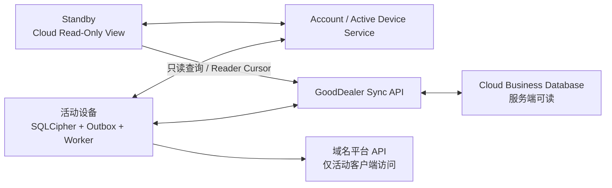

# GoodDealer 账号、设备与云同步

状态：Accepted Design / Evidence Pending
更新日期：2026-08-05

## 1. 设计结论

GoodDealer 采用“本地执行 + 强制云同步 + 单执行设备”的混合架构：

- 云同步是产品基础能力，不提供永久关闭同步或纯本地模式。
- 一个账号在 Windows、macOS、iOS、Android 合计最多绑定两台设备。
- 日常账号/Cloud 路径中，任意时刻只有一台 Active 设备可以产生 Mutation、读取平台、批准操作和执行外部副作用；正式停服后的 LocalContinuation 是不依赖账号、Cloud 或 ActiveDeviceLease 的独立 Sunset 路径。
- 另一台绑定设备处于 Standby，可以进入受限的 Cloud Read-Only View，查看服务端已有业务数据、告警和任务进度，但不能修改业务数据或访问平台。
- 活动设备正常在线时持续续签 ActiveDeviceLease；GoodDealer 云不可用时，凭预签发许可继续执行平台操作最多 24 小时。
- 域名资产和非秘密业务数据同步到 GoodDealer Sync Service，服务端可以读取、查询和处理。
- API Key、OAuth Token、Cookie、密码、平台 2FA、Auth Code、Browser Profile 和数据库密钥不得上传服务端。
- 本地 Backup/Restore 提供用户主动操作的加密备份文件导出与恢复。
- 同步到服务端不等于公开展示；未来资产展示必须由用户显式发布。

用户可以临时离线，Mutation 保存在 Active Workspace 的 `MutationOutbox`；ExecutionFact 与 DeviceAuditEvent 的原始签名 Envelope 保存在与业务库分库分钥、追加式的 `evidence-spool`，并使用各自序列/确认水位续传。设备 Removed/Locked 后同一物理队列只通过 `RemovedEvidenceSpool` 窄读能力开放；“离线”不是一个可永久选择的产品模式。

## 2. 数据分类

### 2.1 强制同步、服务端可读

- `DomainAsset`、`OwnershipEpisode`、`RegistrarBinding`。
- 域名、注册商、到期时间、Nameserver、持有和续费状态。
- Portfolio、标签、备注、购入成本、目标售价和币种。
- Marketplace Listing、价格、上下架状态、销售状态和佣金规则。
- Desired/Observed State、字段基线和冲突记录。
- DNS Zone 与非敏感 DNS Record。
- 脱敏后的所有权验证方式、状态、有效期、最后检查时间、错误分类和完成结果。
- ProviderConnection 的平台、账户别名、远端账户 ID、能力和状态。
- 已脱敏的 Operation 计划、状态、错误分类和审计摘要。
- API 配额范围、剩余量、重置时间、`backoff_until` 和最近刷新时间。
- UI 偏好、保存的筛选器和不包含秘密的自动化设置。

这些数据通过 TLS 传输，在服务端按账号/Workspace 隔离。它们不是端到端密文，GoodDealer 服务端有能力读取。

### 2.2 默认不同步、仅设备本地

- API Key、API Secret、OAuth Access/Refresh Token。
- 平台密码、平台 2FA、恢复码、CAPTCHA 和域名转移 Auth Code。
- 浏览器 Cookie、Local Storage、Browser Profile 和登录会话。
- OS Keychain 中的 `credentialRef` 实际值。
- SQLCipher Master Key、Recovery Secret 和本地完整性密钥。
- 备份口令和备份解密密钥。
- 原始 HTTP Header、未脱敏 URL/Query、完整页面 DOM 和可能含 Token 的原始响应。
- 连接器标记为 `sensitive` 的临时 DNS 验证值或未公开挑战值。

平台凭据不随云端业务数据跨设备同步。某设备此前配置的凭据可以在 Standby 加密保留，但只能在该设备切回 Active 后执行本机健康检查；检查通过后才可复用。新设备、本机检查失败或无法验证、凭据已撤销、丢失、过期时，用户必须重新输入、重新登录，或从用户明确授权的加密备份恢复。Standby 不能读取、健康检查或注入凭据。

### 2.3 字段分类

```text
PUBLIC_BUSINESS      可同步、服务端可读
SENSITIVE_BUSINESS   可同步，但限制员工访问和日志
DEVICE_SECRET        不得离开设备
DIAGNOSTIC_LOCAL     默认仅本地，提交支持请求时另行授权
```

Secure Host 必须在写入 `MutationOutbox` 前移除 `DEVICE_SECRET` 和未授权诊断数据。

## 3. 账号、绑定与活动设备

应用涉及四种职责分离的客户端凭证：

- `AuthSession`：在线账号请求。
- `OfflineDeviceLease`：证明设备已绑定且在授权离线宽限内。
- `EntitlementToken`：短期可刷新的签名投影，证明当前 `AccountEntitlement`、商业有效期、离线宽限和设备名额；Lifetime 权益本身不因 Token 到期而消失。
- `ActiveDeviceLease`：证明本设备是当前唯一执行设备，并允许业务 Mutation、平台读取、操作批准和执行。

Refresh Token、EntitlementToken、OfflineDeviceLease 和 ActiveDeviceLease 都只持久化于 OS Keychain/Credential Manager；Desktop Access Token 只驻 Rust Secure Host 内存 Session Store，启动时由 Host 使用 Refresh Token 换取。普通 TypeScript、配置、日志和业务数据库不保存原值。各类凭证的签发、重放与刷新语义以 [LICENSING.md](LICENSING.md) 为准。

数据模型：

```text
DeviceBinding
  device_id
  account_id
  platform
  device_name
  status: bound | removed
  signing_public_key
  signing_key_id
  signing_key_version
  signing_key_status: active | rotated | revoked
  credential_epoch
  bound_at
  removed_at
  last_seen_at

AccountSecurityState
  account_id
  account_security_epoch
  status: normal | recovery_pending
  recovery_request_id
  destructive_actions_frozen_at
  updated_at

DeviceSwitchRequest
  request_id
  account_id
  from_device_id
  to_device_id
  mode: normal | forced
  status: requested | draining | waiting_expiry | bootstrapping | completed | cancelled | failed
  idempotency_key
  requested_at
  bootstrap_expires_at

ActiveDeviceLease
  account_id
  device_id
  lease_epoch
  issued_at
  renew_after
  online_expires_at
  offline_execute_until
  signature
```

上表是领域语义名。公开 `protocol/devices` JSON Wire 使用显式 lowerCamelCase Codec：ActiveDeviceLease 外层为 `issuedAt/expiresAt`，Payload 为 `leaseEpoch/renewAfter/onlineExpiresAt/offlineExecuteUntil`，其中外层 `expiresAt` 必须等于 `offlineExecuteUntil`。OfflineDeviceLease Payload 为 `credentialEpoch/renewAfter`，其领域 `access_until` 唯一映射到外层 `expiresAt`，并满足 `issuedAt < renewAfter < expiresAt`。Codec 不接受 snake_case Wire 或未知字段。

约束：

- 每个账号最多两个 `bound` 设备，所有桌面和移动平台共用额度。
- 服务端同一账号只能存在一个当前 `lease_epoch` 和 `active_device_id`。
- 同一账号最多存在一个未完成的 DeviceSwitchRequest 和一个与之绑定的短期 Bootstrap Capability；重复请求按幂等键返回原请求，禁止两台 Standby 竞争激活。
- ActiveDeviceLease 使用服务端签名并保存在 OS Keychain/Credential Manager。
- `offline_execute_until <= issued_at + 24 小时`，并可被更早的授权、商业或安全截止收窄；在线续签只滚动延长到新的签名上限。
- Standby 只能获得 `account:manage` 和 `workspace:read`；不得获得 `workspace:mutate`、`platform:read`、`platform:write` 或 `operation:approve`。
- Standby 可以使用可丢弃的只读缓存和 Reader Cursor，但不能创建 Outbox、Desired State、DeviceCredentialBindingStatus 或 ApprovedOperation。
- 旧 Epoch 设备降级为 Standby 后，可以通过独立的 `execution-facts:ingest`、`audit-events:ingest` 与 `recovery-proposals:ingest` 通道上传本机已经持久化、可验签的执行事实、设备审计事件和签名 StaleChangeProposal；这些 Scope 不属于 `workspace:mutate`，不能创建新的 Desired State、服务端 Candidate 字段或平台副作用。
- 设备被移除后不再获得任何 Session、Cloud Scope 或普通 Workspace 读取权。Secure Host 只可从与业务库分库分钥的追加式 `evidence-spool` 通过 `RemovedEvidenceSpool` 窄读能力读取两类已持久化、已脱敏且具有原始设备签名的 ExecutionFact/DeviceAuditEvent：Cloud `removed_at` 前形成的记录；以及 `removed_at` 后、本机尚未确认撤销、且可信 `request_start_boundary/occurred_at` 不晚于原 `offline_execute_until`、原 Lease/批准仍有效的离线记录。它们按下述 Tombstone Challenge 以旧 Key ID/Version 完成实时 PoP 后提交 evidence-only Ingest；接收端固定账号/设备/Tombstone、Cloud 移除时点、本机撤销观察锚点、原 Credential/Lease Epoch、可信时间、序列、大小和速率，验签后只追加或隔离。该入口不接受 Mutation、Proposal/Candidate、秘密或任意查询，也不签发 Token/Lease、恢复绑定或打开业务存储。
- `evidence-spool` 是 `local-storage/evidence-spool` 拥有的独立 SQLCipher 文件和独立 Key Purpose。Host 在 Attempt 结果事务提交前先为 ExecutionFact 与对应 DeviceAuditEvent 分配各自序列、完成域分离签名并追加原始 Envelope；拿到稳定 `spool_entry_id/envelope_id/envelope_digest` 回执后，Active Workspace 才能提交业务引用。崩溃恢复按 ID/digest 幂等修复孤立 Spool 记录或缺失引用，不重签、不改序列。记录至少保存 kind、账号/Workspace/设备、Credential/Lease Epoch、序列、可信时间锚点、Envelope 密文/digest、上传状态、连续确认水位和重试元数据；Cloud 确认或隔离裁决前不得清理。本机准备恢复 Cloud 连接时先进入对账屏障，停止新平台请求并让已提交请求完成或隔离为 `outcome_unknown`、持久化对应 Envelope，再查询撤销状态。首次验证 `RemovedDeviceTombstone` 时，Host 原子持久化 `removal_observed_anchor_id + removal_observed_monotonic_delta_ms`，停止 Worker/Sequencer、关闭业务库，并把旧设备私钥状态转换为 `removed_evidence_pop_only`。该状态只允许签 `GOODDEALER-REMOVED-EVIDENCE-POP-V1`，禁止签发新的 Fact/Audit/Lease/ApprovedOperation 或任何业务授权。只有全部 eligible 证据取得不可变接收/隔离回执并满足本地审计保留条件后，才原子擦除对应 Spool 记录、Spool Key 和旧设备私钥；任一私钥或 Spool Key 缺失都失败关闭，不能降级为无 PoP 上传。
- Standby 只读缓存使用 SQLCipher 或等效静态加密，独立缓存密钥保存在 OS Keychain/Credential Manager；设备此前作为 Active 配置的 `DeviceCredentialBindingStatus` 与 Secure Host 私有 `HostCredentialBinding` 可以继续分别加密保留，但 Standby 无权查询或调用。
- 设备激活要求应用版本支持当前 Workspace `schema_version`；不支持时禁止激活并提示先升级应用。
- 第三台设备必须先移除旧设备后才能绑定。

### 3.1 设备身份生命周期

- 设备签名算法固定为 Ed25519；私钥由 Rust Secure Host 生成并保存在 OS Keychain/Credential Manager，普通 TypeScript、Cloud 与备份永不获得。
- 首次绑定在已重新认证的账号 Session 下创建一次性、短期 `DeviceBindingChallenge`，绑定 Challenge ID、账号、设备、Purpose、Nonce、候选 Key ID/公钥 Fingerprint、期望 Key Version 和重新认证证明。服务端只在验证新钥 PoP 后原子消费 Challenge 并创建 `bound(v1)`。
- 正常轮换创建绑定当前版本的 Rotation Challenge，并要求旧钥与新钥对同一版本化、长度定界、域分离 Transcript 双 PoP；服务端通过 CAS 在同一事务中把旧版本标记为 `rotated` 并创建 `active(vN+1)`。
- 旧钥丢失不能降级为单新钥轮换；必须进入 Recovery/Rebind，重新认证账号并撤销旧设备 Session、OfflineDeviceLease、ActiveDeviceLease、未消费 Challenge 和签名能力。
- 移除设备把状态置为 `removed`、推进 `credential_epoch` 并记录权威 `removed_at`，同时立即撤销该设备的在线 Session、Cloud Scope、未消费 Challenge 和后续 Lease 续签能力。若被移除设备是当前 Active，移除请求同时进入强制切换隔离：服务端在旧 Lease 的 `offline_execute_until` 前不得向其他设备签发平台执行权；设备名额可以释放，新设备可以绑定并使用 Cloud Read-Only View，但只能在隔离截止后进入 Bootstrap。Credential Epoch 不能被描述成能即时阻断已经离线的平台访问。
- 撤销后到达的 ExecutionFact/DeviceAuditEvent，无论是在 Cloud `removed_at` 前形成，还是在其后但本机确认 Tombstone 前于原离线窗口内合法形成，只有在域分离签名、Tombstone Key Version、Credential/Lease Epoch、可信时间锚点、单调增量、`request_start_boundary/occurred_at <= offline_execute_until`、本机 `removal_observed` 边界、各自防重放序列和事件类型对应的授权上下文均可验证时才作为迟到记录处理；仅 ExecutionFact 要求 ApprovedOperation/Plan 授权摘要，普通安全审计不得伪造 Operation 授权。本机确认撤销后新签的普通 Fact/Audit 一律拒绝或隔离；设备自报时间不能单独证明合法发生边界，evidence-only Ingest 也不能恢复任何权限。

公开 Challenge/Proof DTO 由 `protocol/devices` 拥有；Cloud `devices` 拥有 Challenge、DeviceBinding、版本 CAS 和撤销事实；Rust `device-identity` 拥有私钥、Transcript 和签名 Port。完整决策见 [ADR-0011](adr/0011-device-identity-lifecycle.md)。

### 3.2 Workspace Bootstrap 与两阶段激活

账号首次创建 Workspace、首设备绑定、正常设备切换和恢复激活共用账号级唯一的 `BootstrapWorkflow`，但以 `purpose: first_device | device_switch | recovery` 域分离。流程固定为：

1. 在重新认证的账号 Session 下，以幂等键创建或返回同一 BootstrapWorkflow；Cloud 原子固定账号、Workspace、目标设备、目标 Epoch、Schema、Checkpoint 和 Purpose。
2. 设备完成一次性 DeviceBindingChallenge/PoP 后只获得短期、目的限定的只读 Bootstrap Capability。该 Capability 只允许下载绑定 Checkpoint、执行迁移、分页重建、提交摘要和推进当前 Step，不授予 Mutation、平台访问、批准、凭据健康检查或 Worker Scope。
3. 每个 strict step request/result 实际携带所需 Payload，并绑定 Workflow ID、step number、step nonce、前一步摘要和目标设备；同一 canonical request 逐字节幂等返回，同 Step 不同内容、跳步、跨 Purpose/设备/Workspace/Epoch 重放全部拒绝。
4. 设备在隔离 Activating/Staging 中验证完整性并提交最终 Workspace digest。Cloud 以事务 CAS 验证 Workflow/Checkpoint/设备/目标 Epoch 仍匹配后，才消费 Bootstrap Capability、签发递增 Epoch 的 ActiveDeviceLease 并开放 Active Scope。
5. 任一步失败或崩溃只恢复同一 Workflow；取消、过期或不一致必须清理临时 Pin/Capability，不得留下幽灵 Active、并发 Lease 或可复用执行授权。账号级互斥保证同一时刻只有一个未完成 Bootstrap/DeviceSwitch。

恢复路径使用独立 Recovery Capability、Key Purpose 和 Transcript，不能与 Bootstrap Capability 互换；恢复产生的业务差异仍只能形成 Candidate。

## 4. 设备切换

### 4.1 正常切换

1. Standby 设备以幂等键请求“切换到此设备”，服务端创建账号级互斥的 DeviceSwitchRequest。
2. 当前活动设备收到切换请求后仍在 Active 下停止领取新任务，并进入 Draining 前置屏障：禁止再签发 PlatformAccessContext，等待已经提交的单次 HTTP/浏览器最终提交返回，或在超时/崩溃边界把 Attempt 隔离为 `outcome_unknown`；未提交的 Context/请求一律作废。
3. 只有平台 Executor 不再持有可提交请求，且所有已提交请求已经完成或被隔离为 `outcome_unknown`、对应签名 ExecutionFact/DeviceAuditEvent Envelope 与序列已经持久化后，才原子进入 Draining。存在未决请求、未持久化结果或未封口 Sequencer 时拒绝 Mode 转换。Draining 本身不能创建或消费平台 Context、落账新结果或分配新序列，只冲刷进入前既有的 Mutation、ExecutionFact、Workspace-scope DeviceAuditEvent 三条设备侧独立追加流及上传最新 Cursor；User/Staff/Service 和 account-scope DeviceAuditEvent 属于独立链，不参与 Workspace Drain。
4. 当前设备请求释放 ActiveDeviceLease，并提交由设备签名的 `DrainManifest`。Manifest 对 `mutation`、`execution_fact`、`device_audit` 分别携带 `last_assigned_sequence`、本地已确认的 `contiguous_received_through`、`pending_count` 和滚动摘要；三个序列空间不得复用或以最大已见序号代替连续水位。
5. 服务端在一个事务中独立验证自己持有的连续接收水位、Gap、滚动摘要、Proof 签名及 DeviceSwitchRequest/Lease Epoch 绑定，并把它们与设备签名声明的 `last_assigned_sequence/pending_count=0` 比对。后两者是由完整、协作客户端的事务性本地 Sequencer 给出的签名声明，Cloud 无法仅凭现有协议发现设备故障或恶意遗漏的未上传尾部；本地完整性/Sequence 元数据异常时 Host 必须拒签 Proof 并转强制切换。验收通过才释放旧 ActiveDeviceLease、递增待激活 Epoch，并向目标设备签发短期只读 Bootstrap Capability；任一可观察不一致都拒绝进入 Bootstrap并返回缺口列表。该协议保证正常客户端的可验证交接，不宣称对已破坏或恶意客户端提供 Byzantine 完整性证明。
6. 新设备校验应用版本支持当前 Workspace `schema_version`，使用 Bootstrap Capability 固定一个服务端已发布且摘要有效的 Checkpoint，再回放该 Checkpoint 之后的 Mutation 到目标 Revision，建立完整本地工作库并强制执行一轮一致性校验；原只读缓存和 ReaderCursor 不作为 Mutation 基线。Bootstrap 全程 pin 住该 Checkpoint，完成或放弃后才释放。
7. 新设备提交摘要和支持的 Schema 版本，服务端核验后在签发 ActiveDeviceLease 的同一控制面事务中把旧活动设备的 DeviceCursor 置为 `retired(reason=replaced)`，创建/激活新 DeviceCursor 并完成 DeviceSwitchRequest；强制切换使用相同退休规则。旧设备以后再次激活时创建新 Cursor，不复活已退休 Cursor。在此之前 Cloud 和 Rust Host 均不授予 Mutation、平台读取/写入或批准能力。

Bootstrap Capability 是绑定整个激活流程的短期 workflow Capability，而不是首次请求即消费的一次性 Token。下载固定 Checkpoint、拉取后续 Mutation、提交摘要分别使用该 Capability 作用域内的独立 step request 和单调 `step_number + step_nonce`；服务端对每一步做状态 CAS，相同步骤/相同规范请求幂等返回原结果，相同步骤不同 Payload、越序、并发竞争、完成/放弃/到期后重放均拒绝。ActiveDeviceLease 成功签发、流程放弃或超时后才原子消费 Capability 并释放 pin。

签名 Bootstrap Capability 的 Payload 只绑定 `device_switch_request_id`（Wire `deviceSwitchRequestId`）；step 字段不塞入或修改该 strict Payload。`BootstrapStepRequest` 是 strict lowerCamelCase 判别联合，共同字段固定 `schemaVersion=1/deviceSwitchRequestId/capabilityJti/stepNumber/stepNonce/expectedWorkflowRevision/stepKind/stepPayload/requestDigest`。`stepKind + stepPayload` 只能是：

- `pin_checkpoint`：`checkpointId/checkpointRevision/checkpointDigest`，选择一个已发布且摘要有效的 Checkpoint。
- `fetch_mutations`：`pinnedCheckpointId/pinnedCheckpointRevision/pinnedCheckpointDigest/fromRevisionExclusive/throughRevisionInclusive/cursor/pageLimit`；大链可用连续递增的 step number 分页，下一页必须携带上一页响应给出的 cursor，不能在同一步换 cursor。
- `submit_rebuild_digest`：`targetRevision/workspaceSchemaVersion/entityDigests[]`；每个元素是 strict、稳定排序的 `entityType/partitionId?/digest`，用于验证完整本地重建结果。

`requestDigest` 使用版本化、长度定界编码覆盖除 `stepNonce` 与 `requestDigest` 自身外的完整 canonical request，包括全部 `stepPayload`；nonce 仍由服务端工作流状态独立绑定和单次判定，不能用“摘要相同”绕过 nonce/step CAS。响应 `BootstrapStepResult` 也是 strict 判别联合，共同字段为 `schemaVersion=1/workflowRevision/acceptedStepNumber/stepKind/resultPayload/resultDigest`：`pin_checkpoint` 返回固定的 Checkpoint ID/Revision/Digest 与 pin deadline，`fetch_mutations` 返回 strict Mutation 页、页摘要、已返回 Revision 与 next cursor，`submit_rebuild_digest` 返回核验 Revision、核验摘要和 accepted 状态。`resultDigest` 覆盖除自身外的完整 canonical response；同一步相同规范请求重试必须逐字节返回同一结果。`protocol/devices` 必须以 strict DTO 与 TS/Rust/Cloud 正负 Corpus 冻结这些请求/响应后才可实现生产 Bootstrap；当前仅有静态 Capability Envelope，没有上述 step DTO、分页状态机或 Corpus，不能被误解为步骤已交付。

### 4.2 强制切换

当前活动设备丢失、关机或不可达时：

- Standby 可以申请强制切换，但必须等旧 Lease 的 `offline_execute_until` 到期。
- UI 显示最早可接管时间和旧设备最后在线时间。
- 等待期间 Standby 仍可查看云端资产和风险告警；紧急情况提供平台官网手工处置入口，事后由新活动设备重新读取并对账。
- 到期后服务端递增待激活 Epoch，向目标设备签发短期只读 Bootstrap Capability；重建和摘要校验通过后才原子签发 ActiveDeviceLease。
- 旧设备重新连接时发现 Epoch 过期，立即停止 Worker。若设备仍为 `bound` 且 License 有效则降级为 Standby；设备已移除、授权失效或完整性校验失败才进入 Locked。
- 降级后的旧设备使用独立 Ingest 上传 ExecutionFact、DeviceAuditEvent 和签名 StaleChangeProposal；Cloud recovery 独占生成 StaleDeviceCandidate，服务端把通过旧 Epoch 裁决的 ExecutionFact 标记为 `LateExecutionEvent`。上传不能恢复旧 Epoch 的执行权，也不能写当前 Workspace。

外部域名平台不理解 GoodDealer Epoch，因此不能同时承诺旧设备无限离线执行和新设备立即安全接管。24 小时是已确认的可用性与切换速度折中。

## 5. 云同步架构



本地修改流程：

1. 活动设备在本地事务中修改领域实体。
2. 同一事务写入 `MutationOutbox`。
3. UI 立即读取本地结果。
4. Sync Worker 批量上传 Mutation。
5. 服务端验证账号、活动设备 Epoch、Schema、权限和 `base_revision`。
6. 服务端提交新 Revision并返回服务器序号。
7. 以后切换到另一台设备时，从固定的已发布 Checkpoint 加后续 Mutation 重建正式工作库；DeviceCursor 记录活动工作库消费位置，ReaderCursor 仅用于租约与保留水位仍有效的 Standby 增量读取，不能作为 Bootstrap 基线。

禁止上传或下载整个 SQLite/SQLCipher 数据库、WAL 或应用数据目录。云端使用正规化业务 Schema 与 Mutation Log。

Standby 读取流程不属于平台同步：它只查询 GoodDealer Cloud 已有数据，不调用连接器、不刷新外部平台，也不产生 Sync Mutation。只读缓存可以随时清除；设备激活时必须以当前 Server Revision 建立正式工作副本。

## 6. 同步时机与触发器

同步协议之外，何时同步是独立的设计约束：单执行设备架构下，云端的新鲜度完全取决于活动设备的上传时机。

总原则：周期同步保证最终一致，事件驱动同步保证关键时刻；可阻塞的不可逆状态迁移以冲刷成功为前置条件。

### 6.1 事件驱动上传

- 本地事务提交是正确性来源：领域实体与对应的 Mutation、ExecutionFact 或 DeviceAuditEvent 追加记录同事务落库，上传是异步传播，不是一致性依赖；本地写入永不等待服务端确认。User/Staff/Service AuditEvent 由服务端事务追加，不进入该设备侧事务或上传队列。
- Mutation、ExecutionFact 或 DeviceAuditEvent 落库后在短去抖窗口（建议 2～5 秒）内按各自队列批量上传；User/Staff/Service AuditEvent 由服务端链自行追加，不属于设备队列。批量操作合并为批次请求，不逐条往返。
- 应用打开期间保持周期兜底冲刷（建议 30～60 秒）。
- 断网时三条上传队列只增不减，恢复联网后按各自连续序列续传。

### 6.2 强制冲刷点

强制冲刷点分为两级：

阻塞型——冲刷失败时阻塞对应状态迁移，不得跳过：

- 设备切换释放 ActiveDeviceLease 前（见 4.1 排空验收）。
- Schema 迁移开始前。
- 创建 `SynchronizedBackup` 前，必须在同一短写门禁中固定本地提交序号、Server Revision、逐流确认水位和 SQLite 一致性读取源，再通过带 `synchronized_snapshot_binding` 的三流 `DrainProof(purpose=synchronized_backup)`；Backup Manifest 引用确切的 `proof_id + proof_digest`。该证明不得绑定 DeviceSwitchRequest，也不能释放 Lease 或推进 Epoch；边界漂移或旧 Proof 重放必须失败关闭。

尽力型——立即尝试冲刷，失败不阻塞该事件，三条队列本地持久保留并在下一时机续传：

- 应用退出、挂起或 OS 休眠前。
- 移动端切入后台时立即冲刷，不依赖后台定时器。
- License 离线宽限结束、客户端锁定前；冲刷失败不推迟锁定，未同步增量待恢复授权后先行上传。
- 恢复网络连接时。

### 6.3 上传优先级

上传调度不是单一 FIFO。Mutation、ExecutionFact 和 DeviceAuditEvent 分属三个设备侧独立序列与队列；调度器可以让执行事实、Sold/所有权状态变化和高风险审计优先于标签、备注、UI 偏好，但每条流的服务端确认都必须维护连续水位和 Gap 集，不能用跨流优先级改变流内序列含义。

### 6.4 拉取策略

单执行设备使云端在活动期间几乎不产生本设备之外的新内容，拉取策略是不对称的：

- 活动设备：激活时阻塞式基线对齐（见 4.1），每次上传后确认新 Revision，另以低频周期（建议 5～15 分钟）拉取网页端删除请求、合规 Tombstone 等服务端来源事件。
- Standby：打开 Cloud Read-Only View 时立即拉取，视图停留期间周期刷新（建议 30～60 秒），支持手动刷新；全部经 Reader Cursor 增量读取。

### 6.5 Lease 续签搭载同步进度

ActiveDeviceLease 续签请求携带三条流各自的 `last_assigned_sequence`、`contiguous_received_through` 和待上传数量。该进度只用于可观测性与风险提示，不等价于 handoff 的签名 `DrainManifest`。服务端据此持续掌握云端落后活动设备的记录数，用于：

- Standby 视图显示“活动设备有 N 条修改未同步”。
- 强制切换等待界面预估接管后将进入恢复中心的旧修改规模。

### 6.6 失败、退避与残余风险

- Sync API 返回 429/5xx 时指数退避；阻塞型冲刷点的失败阻塞对应迁移并向用户说明原因。
- 活动设备 UI 常驻显示未同步修改数与最后成功同步时间。
- 已接受的残余风险：活动设备在未同步增量上传前永久损失（磁盘损坏、被盗且无备份）时，该增量不可恢复。以冲刷节奏、未同步计数提示和本地备份引导收窄该窗口，不承诺为零。

日志分类、回放边界与一致性校验见 [SYNC_SEMANTICS.md](SYNC_SEMANTICS.md)；Mutation Log Checkpoint 与保留策略见 [DATA_LIFECYCLE.md](DATA_LIFECYCLE.md)。

## 7. 云同步与执行数据模型

```text
Workspace
  id
  account_id
  schema_version
  server_revision

SyncMutation
  mutation_id
  workspace_id
  entity_type
  entity_id
  base_revision
  changed_fields
  source_device_id
  active_lease_epoch
  mutation_sequence
  server_revision

DeviceCursor
  workspace_id
  device_id
  last_pulled_revision
  status: active | retired
  retired_at
  retired_reason: device_removed | workspace_left | replaced

ReaderCursor                  # Standby 可丢弃只读游标
  workspace_id
  device_id
  last_read_revision
  lease_expires_at
  status: active | retired
  resume_requirement: none | rebootstrap_required
  retired_at
  retired_reason: ttl_expired | device_removed | compaction_race

ProviderConnectionShared
  id
  provider
  account_alias
  remote_account_id
  capabilities
  quota_scope
  rate_limit_state
  backoff_until

DeviceCredentialBindingStatus # Active Workspace 可见的脱敏本机状态
  binding_id
  provider_connection_id
  device_id
  provider
  credential_profile_id
  credential_profile_version
  credential_fingerprint
  credential_health
  health_generation
  binding_version

DeviceCredentialCandidateStatus # 普通本机层、Standby 可读的非秘密存在性提示
  provider_connection_id
  device_id
  candidate_state: never_configured | configured_candidate | unknown
  state_version

HostCredentialBinding         # 仅 Rust Secure Host 私有
  binding_id
  provider_connection_id
  binding_scope:
    active_device: device_id
    sunset_installation: sunset_installation_id + workspace_id + sunset_credential_generation + device_signing_key_id + device_signing_key_version
  provider
  credential_namespace
  credential_profile_id
  credential_profile_version
  slots[]
    slot_id: SlotId
    secret_kind: SecretKind
    credential_ref
  credential_health
  health_generation
  binding_version

BrowserSessionProfile         # 仅客户端，由 browser-automation 拥有
  browser_profile_id
  profile_scope:
    active_device: device_id
    sunset_installation: sunset_installation_id + workspace_id + sunset_credential_generation + device_signing_key_id + device_signing_key_version
  provider_connection_id
  session_mode: persistent | private
  profile_ref
  session_health
  profile_generation
  session_sequence

ApprovedOperation             # 活动设备本机生成
  operation_id
  account_id
  workspace_id
  plan_hash
  executor_device_id
  active_lease_epoch
  approved_actions
  materialized_target_digest
  connector_capability_versions
  approved_at
  expires_at
  signing_key_id
  signing_key_version
  credential_epoch
  signature_transcript_version
  device_signature

ExecutionFact                 # 所有 Epoch 的既成执行事实
  execution_fact_id
  operation_id
  operation_item_id
  workflow_node_id
  attempt_id
  attempt_no
  approved_operation_id
  plan_hash
  idempotency_key_hash
  source_device_id
  active_lease_epoch
  execution_sequence
  event_type
  evidence_level
  occurred_at
  received_at
  signing_key_id
  signing_key_version
  credential_epoch
  trusted_time_anchor_id
  monotonic_delta_ms
  request_start_boundary
  authorization_hash
  execution_authorization_evidence  # 域分离、只读；仅供 Cloud 验证批准来源
  signature_transcript_version
  payload_redacted
  audit_event_ref
  audit_event_hash
  device_signature

DeviceAuditEvent              # Desktop/Mobile 上设备与用户行为的设备签名链
  audit_event_id
  audit_event_kind: device
  event_type
  scope_kind: account | workspace
  account_id
  workspace_id: required only for workspace scope
  actor_kind: user | device_service
  actor_id
  authorization_source: user_session | approved_operation | device_binding | runtime_security_context
  target_type
  target_ref
  source_device_id
  active_lease_epoch: required only for workspace scope
  credential_epoch
  chain_id
  audit_sequence
  previous_hash
  event_hash
  occurred_at
  signing_key_id
  signing_key_version
  signing_key_purpose: device_identity_audit
  trusted_time_anchor_id
  monotonic_delta_ms
  authorization_context_hash
  signature_transcript_version
  payload_redacted
  device_signature

UserAuditEvent | StaffAuditEvent | ServiceAuditEvent  # 服务端签名的独立链
  audit_event_id
  audit_event_kind: user | staff | service
  event_type
  tenant_scope: global | account | workspace
  account_id: required for account/workspace scope
  workspace_id: required only for workspace scope
  target_type
  target_ref
  actor_kind: user | staff | service
  actor_id
  authorization_source: user_session | admin_read_authorization | admin_action_authorization | service_identity | tenant_job_context
  chain_id
  audit_sequence
  previous_hash
  event_hash
  occurred_at
  authorization_context_hash
  payload_redacted
  cryptographic_signer_kind: gooddealer_audit_service
  cryptographic_signer_id
  signing_key_purpose: user_audit | staff_audit | service_audit
  signing_key_id
  signing_key_version
  signature_transcript_version
  server_signature

DrainProof
  proof_id
  purpose: handoff | synchronized_backup
  workspace_id
  source_device_id
  active_lease_epoch
  device_switch_request_id: required only for handoff
  synchronized_snapshot_binding: required only for synchronized_backup
    local_commit_sequence
    server_revision
  streams[mutation | execution_fact | device_audit]
    sequence_domain: workspace_id + source_device_id + active_lease_epoch + stream
    last_assigned_sequence
    contiguous_received_through
    pending_count
    rolling_digest
  canonical_codec_version
  digest_algorithm: sha256-chain-v1
  issued_at
  expires_at
  signing_key_id
  signing_key_version
  signature_transcript_version
  device_signature

DrainManifest                 # DrainProof 的 handoff 专用变体
  purpose: handoff
  device_switch_request_id: required

StaleChangeProposal           # 设备签名的旧 Epoch 可变修改提案
  proposal_id
  idempotency_key
  workspace_id
  source_device_id
  active_lease_epoch
  source_revision
  field_path                  # 一字段一 Proposal / Candidate
  base_value_hash
  candidate_value
  signing_key_id
  signing_key_version
  signature_transcript_version
  device_signature
```

`DeviceCredentialCandidateStatus` 不证明凭据存在、有效或可用，也不是 `DeviceCredentialBindingStatus` 的降级副本。新设备首次看到 ProviderConnection 时初始化为 `never_configured`；Secure Host 成功提交完整凭据写事务后置为 `configured_candidate`；用户显式删除该设备凭据后置回 `never_configured`；旧版本迁移缺字段、状态文件损坏、重装后无法证明历史或 Host 检测到状态与秘密存储不一致时置为 `unknown`。状态更新只接受上述 Host/迁移来源并单调推进 `state_version`，不得通过读取 Keychain、Browser Profile、凭据值或执行健康检查来渲染 Standby 页面。切回 Active 后仍必须以 HostCredentialBinding 的权威 health/generation 完成健康检查。

`HostCredentialBinding.binding_scope` 与 `BrowserSessionProfile.profile_scope` 都是 Host 私有 strict 判别联合：日常分支只使用 `active_device + device_id`；Sunset 分支只使用 `sunset_installation + sunset_installation_id/workspace_id/sunset_credential_generation/device_signing_key_id/version`，不含 Cloud device ID。两种分支使用不同 Keychain/Profile namespace 和唯一索引，Sunset credential generation 推进必须切换 scope 并重新录入或复验，跨分支或跨 generation 的 ID、Ref 重放失败关闭。`BrowserSessionProfile` 以 `profile_scope + provider_connection_id + session_mode` 唯一，`browser_profile_id/profile_ref/session_health/profile_generation/session_sequence` 全部是 Browser Host 私有状态。`profile_generation` 在创建、清除/重置、账号身份变化后的重新认证、损坏恢复、Profile 迁移或 Key/Namespace 重绑时单调推进；普通 Cookie 刷新和 Recipe 允许的导航不推进。`session_sequence` 在 Session 创建/重建、用户接管、越界手工导航、private Session 重置或关闭时推进；当前 Ticket 允许的 Recipe Step 不推进。两者回退、缺失或变化都会使已签发 Sunset Context/Ticket 在访问 Profile 前失败关闭。

`mutation_id` 全局唯一并幂等。云端同步状态不能直接产生外部副作用；Worker 只执行本机签名有效、Epoch 匹配且未过期的 ApprovedOperation。

`ApprovedOperation` 的签名 Transcript 固定使用域 `GOODDEALER-APPROVED-OPERATION-V1`，对上述除 `device_signature` 外的完整字段做版本化、长度定界的确定性编码。`ExecutionAuthorizationEvidence` 必须保存该原始签名 Envelope 或其 canonical bytes 与 digest，并固定引用签名时的 Key ID/Version、Credential Epoch 和 Transcript Version；密钥轮换后仍按批准时公钥验证，不能试探多把历史钥或把 Evidence 恢复为可执行授权。

`ExecutionFact` 使用独立的追加式 `ExecutionFact` Ingest，不经过 SyncMutation。Audit 协议是封闭判别联合，`audit_event_kind + event_type` 属于签名内容；接收端先按 kind 选择 Schema、授权矩阵和 Key Purpose，再验签，禁止把 read 的授权上下文复用于 delete 或任意组合 actor/signer：

| audit_event_kind | actor_kind | authorization_source | 密码学 signer / Key Purpose |
| --- | --- | --- | --- |
| device | user / device_service | user_session、approved_operation、device_binding 或 runtime_security_context 中与 `event_type` 对应的一种 | Device Identity Key / `device_identity_audit` |
| user | user | user_session | GoodDealer Audit Service / `user_audit` |
| staff | staff | admin_read_authorization 或 admin_action_authorization | GoodDealer Audit Service / `staff_audit` |
| service | service | service_identity 或 tenant_job_context | GoodDealer Audit Service / `service_audit` |

`DeviceAuditEvent` 只记录 Desktop/Mobile 上由设备签名的设备与用户行为；account-web/Public API 用户动作形成服务端签名的 `UserAuditEvent`，Staff/Service 同理。Session、StaffIdentity 或 Job Context 是 actor/授权来源，不是密码学 signer。账号登录、设备绑定/移除、License、DataRightsRequest 和全局运维不得伪造 Workspace：每类事件以 `tenant_scope/scope_kind + account_id? + workspace_id? + target_type/ref` 表达真实作用域；global Service 链不绑定账号。User/Staff/Service 事件不伪造设备、Lease 或 ApprovedOperation 字段，也不进入设备上传队列、Gap 或 Drain。

以上 ExecutionFact/DeviceAuditEvent 只属于日常 Active/Epoch 路径。LocalContinuation 必须使用 [OPERATIONS.md](OPERATIONS.md) 定义的 `SunsetExecutionFact` 与 `SunsetDeviceAuditEvent`：不含账号、ActiveDeviceLease、`active_lease_epoch`，使用独立 `gooddealer.sunset.execution-fact.v1`/`gooddealer.sunset.device-audit.v1` Key Purpose、Transcript 与本地唯一追加链；它们不得进入 Cloud Ingest、MutationOutbox、三流 Drain、LateExecutionEvent 分类或上述日常解析器。

每条 Audit 链使用确定性 domain：Workspace Device 为 `(device_audit, workspace_id, source_device_id, active_lease_epoch)`，Account Device 为 `(account_device_audit, account_id, source_device_id, credential_epoch)`，服务端链为 `(audit_event_kind, tenant_scope, tenant_id?, actor_id)`；`chain_id` 由 domain 规范编码派生并受数据库唯一约束。追加事件必须在一个事务中以 `expected_sequence + previous_hash` 对当前唯一 head 做 CAS；并发失败重试，禁止另起链。Key 轮换继续原链并追加签名 key-transition 事件，不得通过换 Key 创建平行链。只有 Workspace Device 链参加三流 Drain；Account Device 与 User/Staff/Service 链独立续传且不阻塞 handoff。上传发生在旧 Epoch 时，服务端验证签名 Transcript 中的 Kind/Event Type、Key ID/Version、Credential/Lease Epoch、可信时间锚点、单调增量、请求开始边界和对应授权摘要；通过的 ExecutionFact 以 `LateExecutionEvent` 分类追加到同一 execution-ledger，通过的 DeviceAuditEvent 仍写入其对应设备审计链。上传延迟本身不能丢弃合法记录；无法证明发生时间或授权范围的报告进入各自安全隔离区并要求当前活动设备对账。

每条流从 sequence `1` 开始；空流摘要是域分离常量 `GOODDEALER-DRAIN-SHA256-V1` 的 SHA-256。后续 `rolling_digest = SHA-256(previous_digest || uint32_be(canonical_envelope_length) || canonical_envelope_bytes)`，严格按 sequence 计算，重复记录不推进，Gap 补齐后再推进连续摘要。Canonical Envelope 只包含设备提交时已签名的协议字段，明确排除 Cloud 富化的 `server_revision`、`received_at`、Late 分类及其他 Ingest/存储元数据；字段顺序、整数/时间编码和版本由 `protocol/execution-events` Golden Corpus 固定，并包含“服务端富化不改变 digest”的向量。客户端与 Cloud 不得按到达顺序或普通 JSON 字符串计算。`proof_digest = SHA-256("GOODDEALER-DRAIN-PROOF-V1" || uint32_be(canonical_signed_proof_length) || canonical_signed_proof_bytes)`，覆盖完整设备签名 Proof Envelope 并排除服务端元数据。Cloud 以 `proof_id` 唯一保存 digest/purpose/accepted_at/expires_at/consumed_at；handoff 在 Lease 释放事务消费，synchronized_backup 在封存唯一 Backup Manifest 时消费，过期、已消费、同 ID 不同 digest 或冻结边界不匹配均拒绝。`secure-host-core/stream-signing` 对 ExecutionFact、DeviceAuditEvent、StaleChangeProposal 和 DrainProof 使用不同域分离 Transcript；本地 HMAC 只证明磁盘完整性，不能作为 Cloud Ingest 签名。

## 8. 平台读取与写入

### 8.1 日常账号/Cloud 路径的读取协调

- 日常账号/Cloud 路径中只有 Active 设备执行外部平台读取，Standby 只能读取 GoodDealer Cloud 已有快照，不运行任何平台后台刷新。正式停服后的 LocalContinuation 只能经 Sunset 授权读取平台，结果只更新独立本地 `local-continuation-workspace/platform-sync`，不读取或更新 Cloud Revision、共享 quota 摘要、Mutation、Cursor 或 Ingest。
- `Priority-2 Workflow`、`Priority-3 Bulk`、`Priority-4 Maintenance` 刷新全部由活动设备执行。
- 切换设备时同步非秘密限流摘要，新设备继承 `backoff_until`，不能立即重复全量刷新。
- 连接器声明 `quotaScope: credential | provider_account | provider_global | unknown`。
- 平台返回的 Rate Limit Header 和 429 更新云端共享状态；API Key 本身不上传。

### 8.2 外部写入

- 不再为每个 Operation 申请跨设备执行租约。
- Worker 执行前校验 ActiveDeviceLease、`lease_epoch`、ApprovedOperation 签名和本地资源锁。
- GoodDealer 云可用时持续续签 Lease 并正常同步结果。
- GoodDealer 云不可用但 `offline_execute_until` 未到期时，活动设备可以继续平台写入；结果标记 `uncoordinated_execution` 并进入 ExecutionFact 队列，对应 DeviceAuditEvent 进入独立设备 Audit 队列，不进入 Mutation Outbox。
- 24 小时许可到期后，可以继续本地查看、编辑和准备计划，但暂停新的平台读取与写入。
- 云恢复后先上传未协调结果、确认 `outcome_unknown` 并重新对账，再执行新任务。

## 9. 过期 Epoch 的事实与修改

正常切换前必须分别冲刷 Mutation、ExecutionFact、Workspace-scope DeviceAuditEvent 三条流并通过签名 DrainManifest，因此通常不会产生设备并发冲突；Account-scope DeviceAuditEvent 独立续传，不阻塞 handoff。

强制切换后，旧设备可能同时保留已经发生的执行事实和尚未同步的业务修改。两者不得共用 Candidate 通道。

### 9.1 ExecutionFact、LateExecutionEvent 与 DeviceAuditEvent

- Operation 请求尝试、远端任务 ID、平台响应、确认等级和 `succeeded/failed/outcome_unknown` 始终作为 `ExecutionFact` 追加保存；旧 Epoch 验证通过后由服务端分类为 `LateExecutionEvent`，而不是由客户端把普通事实改写成另一种日志。
- 每条 ExecutionFact 必须绑定具体 Operation Item、Workflow Node、Attempt、ApprovedOperation、Plan Hash 和稳定幂等键摘要。服务端验证来源设备曾持有对应 Epoch、ActiveDeviceLease 和 ApprovedOperation 签名有效、计划 Hash 匹配且 execution sequence 未重放。
- 旧设备的安全与业务审计始终作为独立 `DeviceAuditEvent` 写入设备 Hash 链；ExecutionFact 只保存 `audit_event_ref/hash`，不得内嵌或替代真正的 DeviceAuditEvent。account-web/Public API 用户动作使用 UserAuditEvent；User/Staff/Service AuditEvent 属于服务端链，不使用设备 Lease Epoch。
- 验证通过的记录即使在切换后才上传也不能由用户丢弃；无效或无法验证的 ExecutionFact/DeviceAuditEvent 分别进入安全隔离区，不进入当前业务状态流。
- ExecutionFact/LateExecutionEvent 只补全操作历史与对账证据，DeviceAuditEvent 只补全设备审计证据；二者都不直接覆盖当前 Desired/Observed State，也不能触发新的平台副作用。
- `outcome_unknown` 必须保留到当前活动设备通过平台读取、报告文件或用户确认得到权威结果。
- 旧设备的执行事实入库后，当前活动设备优先执行远端对账；手工或离线期间的实际变化最终作为新 Observed State 收敛。

### 9.2 StaleDeviceCandidate：可选择的旧修改

- 带旧 `active_lease_epoch` 的 Desired State、价格目标、标签、备注、Portfolio 等可变业务修改不直接写入当前 Workspace。
- 设备只能提交“一字段一 Proposal”的签名 `StaleChangeProposal`，包含稳定 `proposal_id/idempotency_key`、Workspace/设备/原 Epoch、来源 Revision、唯一字段路径、基线 Hash、候选值和域分离签名；一个本地批量修改必须拆成多个各自可审阅、可 CAS 的 Proposal，不能把数组藏入 `candidate_value` 绕过字段白名单。Cloud recovery 独占生成一对一的 `StaleDeviceCandidate` 及其 `candidate_id/comparison_revision/current_value_hash/status`。服务端以 `(workspace_id, source_device_id, active_lease_epoch, proposal_id)` 唯一：相同 ID 与相同 canonical digest 的重复提交返回同一 Candidate，相同 ID 不同内容或跨 Epoch/设备重放失败关闭。Proposal 自报或伪造服务端裁决字段时同样拒绝；ExecutionFact 和 AuditEvent 绝不进入 Candidate。
- 当前活动设备在恢复中心查看云端当前值、旧设备值和原始基线。
- Candidate 固定保存 `candidate_id/kind/workspace_id/source_ref/comparison_revision/field_path/base_value_hash/candidate_value/current_value_hash/status(open|rebase_required|applied|discarded|expired)/created_at/updated_at`。用户审阅只针对该冻结比较版本。
- 应用时必须提交 `expected_revision + expected_current_value_hash + candidate_id` 做字段级 CAS；Revision 或字段 Hash 不匹配时原子转为 `rebase_required`，重新计算、展示并再次批准，不能沿用旧选择。CAS 成功后才基于当前 Server Revision 生成新 Mutation，并幂等标记 `applied`。
- Sold、Nameserver、DNS 删除、所有权和价格等高风险字段不能批量静默恢复。

## 10. 备份恢复语义

备份统一使用版本化加密容器和字段级白名单 `BackupExportSchema`。`SynchronizedBackup` 绑定已通过的 `DrainProof(purpose=synchronized_backup)`；GoodDealer Cloud 不可达或排空失败时，用户可以显式创建标记为未同步的 `EmergencyLocalSnapshot`。SQLite Backup API 只用于产生一致性读取源，完整 Active Workspace/WAL/运行时表不得成为最终工件。两类备份恢复都不能静默回滚云端：

1. 把备份恢复到隔离 Staging Database，并以绑定同一设备、Workspace、当前 Lease Epoch、`backup_id + manifest_digest` 的 `RecoveryCapability(purpose=local_recovery)` 打开；Bootstrap Capability 不能替代。
2. 校验 Workspace、Schema、备份时间和备份 Server Revision；拉取当前 Cloud 基线，但不写正式工作库。
3. 客户端只提交 Manifest-bound `BackupExportSchema` 白名单 diff；Cloud recovery 独占生成 `RestoreCandidate` 并返回稳定回执。Recovery Capability 不允许 Apply Candidate、生成 Mutation 或签发 ActiveDeviceLease。
4. Candidate 创建与一致性校验完成后安全销毁 Staging 及其临时 Key，不保留可再次打开的“封存”业务副本。
5. 使用当下最新 Cloud Checkpoint + 后续 Mutation 重新构建正式工作库，通过摘要校验并回到 Active；不得把 Staging 安装为 Active。
6. 回到 Active 后才允许用户逐字段选择并以 `comparison_revision + current_value_hash` CAS Apply；失败时进入 `rebase_required` 并重新批准，成功后生成新 Mutation。
7. 平台凭据等本地数据可以在当前设备单独恢复，不参与云端覆盖。
8. 旧 Operation 只恢复历史摘要，不能重新入队；Mutation/ExecutionFact/DeviceAuditEvent 上传队列、Gap 集、Worker Lease、批准、Ticket、DeviceSwitchRequest 和 Bootstrap/Recovery Capability 永不恢复。仅 `EmergencyLocalSnapshot` 可以额外携带 `PendingSignedEvidenceArchive`：它只保存尚未上传的原始签名 ExecutionFact/DeviceAuditEvent Envelope 与验证所需链材料，不保存队列状态、设备私钥或执行能力。Archive 只有恢复到同一设备身份、OS 安全存储中仍存在匹配原 Key ID/Version 私钥，且原 Ingest 或 RemovedEvidenceSpool 状态机允许时，才能保持原 ID、序列和签名提交；跨设备、旧私钥缺失或已擦除时只能作为加密取证材料保全，不能由当前 Active 代提交、降级为无 PoP 上传、重签、改写、重新执行、转成 Mutation 或恢复权限。

Recovery Capability 同样绑定完整恢复 Workflow：拉取固定当前基线、提交 Manifest-bound diff、读取 Candidate 回执使用独立的单调 `step_number + step_nonce` 和服务端状态 CAS；同一步相同请求幂等，不同 Payload、越序或并发竞争失败关闭。Candidate 创建回执成功、流程放弃或到期后原子消费 Capability；被消费后不能继续读取、重提 diff 或进入另一备份流程。

签名 Recovery Capability 使用独立 V1 域：Wire `schemaVersion=1`、`typ=gd.recovery-capability.v1`、`iss=https://accounts.gooddealer.com`、`aud=gooddealer-desktop/local-recovery`，验签 Key Purpose 固定 `gooddealer.devices.recovery-capability.v1`（Key Purpose 是验签器/Key Registry 的域，不是调用方可选择的额外 JSON 字段）。其 strict Payload 固定 `recoveryWorkflowId/deviceId/workspaceId/leaseEpoch/backupId/manifestDigest/purpose=local_recovery`；Bootstrap 解析器、Key Purpose 和 audience 必须双向拒绝该 Envelope。

每次调用使用 strict lowerCamelCase `RecoveryStepRequest` 判别联合，共同字段为 `schemaVersion=1/recoveryWorkflowId/capabilityJti/stepNumber/stepNonce/expectedWorkflowRevision/stepKind/stepPayload/requestDigest`。`stepKind + stepPayload` 只能是：

- `pin_cloud_baseline`：`checkpointId/checkpointRevision/checkpointDigest`，请求固定当前可验证 Cloud 基线。
- `submit_manifest_diff`：`backupId/manifestDigest/baselineRevision/backupExportSchemaVersion/diffEntries[]/diffDigest`；`diffEntries` 是完整、strict、有界且规范排序的 `BackupExportSchema` 白名单差异，不能只提交摘要或夹带队列、授权、秘密引用和非白名单字段。
- `read_candidate_receipt`：`candidateRequestId/candidateRequestDigest`，只能读取本 Workflow 上一步已创建 Candidate 的稳定回执。

`requestDigest` 使用版本化、长度定界编码覆盖除 `stepNonce` 与 `requestDigest` 自身外的完整 canonical request，包括完整 `stepPayload`；nonce 仍由服务端工作流状态独立绑定和单次判定。响应 `RecoveryStepResult` 是 strict 判别联合，共同字段为 `schemaVersion=1/workflowRevision/acceptedStepNumber/stepKind/resultPayload/resultDigest`：`pin_cloud_baseline` 返回固定 Checkpoint/Revision/Digest 与 pin deadline，`submit_manifest_diff` 返回稳定 `candidateRequestId/candidateRequestDigest` 与创建状态，`read_candidate_receipt` 返回该请求的 Candidate 引用集合、比较 Revision 和 receipt digest，不返回 Apply 能力。`resultDigest` 覆盖除自身外的完整 canonical response；相同步骤相同规范请求重试必须逐字节返回同一结果。上述 Recovery Capability Envelope、step DTO、Cloud Handler 和共享 Corpus 当前均未实现，仍由 R0-06/R0-08/R0-16 阻塞，不能从本文设计推断为已交付。

云端不可用时，备份只能打开在隔离只读区；不能替换当前同步库。只有明确创建全新 Workspace 时，才允许以备份业务数据初始化云端。

## 11. GoodDealer 账号安全

采用消费级账号安全，不引入强制 2FA、TOTP 或企业组织策略：

- 邮箱验证和安全的密码哈希。
- 登录、注册、密码重置和验证码接口限流。
- 可选 Passkey。
- 账号网页端提供会话和绑定设备列表，可远程退出/移除。
- Refresh Token 轮换和旧 Token 复用检测。
- 密码重置、账号接管恢复或 SecurityIncident 遏制会原子递增 `account_security_epoch`，撤销全部在线 Auth/Refresh Session、未消费 Challenge/Bootstrap 和后续 Lease 续签，并进入 `recovery_pending`；所有新签 Auth/Entitlement/Offline/Active 凭证都绑定当前账号 Epoch。
- 新设备绑定、密码修改、数据导出和设备移除发送邮件通知。
- 删除账号、导出数据、移除活动设备时要求重新输入密码；启用 Passkey 的用户可以用 Passkey 确认。

不提供 GoodDealer TOTP、强制第二因素或恢复码体系。平台自身的密码、2FA 和 CAPTCHA 仍由用户在平台页面处理。

`AccountSecurityState` 只有 `normal | recovery_pending`。`recovery_pending` 期间只开放目的限定的账号恢复、安全通知和各平台官网人工撤销引导；冻结新设备绑定、设备切换、邮箱/密码再次修改、账号删除、License 转移和其他破坏性账号动作。完成身份核验、通知与冷静期后只能原子回到 `normal` 并签发新 Epoch 凭证。旧设备已取得的离线平台能力无法被服务端即时撤回，仍受原 `offline_execute_until` 与新设备独占隔离约束；界面必须明确引导用户到各平台撤销 API/OAuth/Browser Session，不能把账号 Epoch 宣称为即时平台阻断。

### 11.1 GoodDealer Staff 管理访问

内部管理员使用独立 StaffIdentity 和 Admin API，不复用用户账号 Session。普通用户“不强制 2FA”的决定不适用于 Staff；首版只有一名管理员（Owner），正式环境强制 Passkey。Role/Scope 结构保留但首版只签发 Owner 身份，未来增加 Staff 时再启用角色细分。

- Owner 默认查看账号、设备、License 和健康摘要；读取跨账号域名业务明细必须消费独立短期 `AdminReadAuthorization`，不要求用户逐次授权。该授权绑定 authorization ID、actor/Staff Security Epoch、Tenant/目标账号及其 `account_security_epoch`、字段/实体 Scope、查询目的与规范 Query Shape Hash、`AdminPurposeRef` 状态/revision、`reauth_proof_id/verified_at/expires_at`、`issued_at/expires_at` 和撤销状态；每次明细请求都复验，不能兑换或复用于 AdminActionAuthorization。`AdminPurposeRef` 是 `SupportCaseReference | DataRightsRequestId | SecurityIncidentId` 判别联合，不能用伪造外部工单替代内部合规或安全案件。
- Owner 可以诊断 Mutation、Cursor、Checkpoint、Candidate、Execution Ledger 隔离区和 Jobs，但不能创建用户 Mutation 或代表用户访问平台。
- 所有 Admin 查询和修改通过模块显式 Admin Application Port。跨账号业务明细读取和高风险动作要求 Passkey 重新认证；异步动作引用的 `AdminActionAuthorization` 必须绑定 Tenant/目标、目标 `account_security_epoch`、命令参数 Hash、命令相关 Aggregate Revision、actor、Staff Security Epoch、Scope、AdminPurposeRef 状态/revision、有效期、消费/幂等与取消状态；删除/设备/License 命令还分别绑定 `deletion_epoch`、`credential_epoch`、`entitlement_revision`，执行和重放时全部复验，并持久化前后摘要。PurposeRef 允许状态与动作范围以 [用户旅程 §6.6](USER_JOURNEYS.md#66-案件与管理员权限) 为准。
- 单 Owner 首版不做多人审批；目标模块仍拥有具体 Repair Command，禁止万能 Admin Command、直接业务 Repository 或任意 SQL。
- Owner 对账号删除的管理能力只允许在请求已经进入 `frozen` 后重试或推进；不得凭 Staff Passkey 代用户新建删除，也不得主动触发 `identity_verified -> frozen`。唯一 Owner 丢失 Passkey 时保持失败关闭，恢复仪式在 JF-14 关闭前不得以邮箱找回或隐式 Break Glass 代替。
- Cloud 从未持有的平台凭据、Cookie、Browser Profile、数据库密钥和本地备份秘密对管理员同样不可见。

## 12. License 过期与合规入口

订阅和离线宽限结束后，客户端不进入业务主界面，也不允许客户端查看、导出、备份或执行平台操作。

账号网页端不属于授权业务功能，过期后仍提供：

- 服务端持有业务数据的机器可读导出（JSON/CSV/ZIP）。
- 账号与云端数据删除请求。
- 会话、绑定设备和账号安全管理。

网页导出不包含服务端从未持有的 API Key、Cookie、Browser Profile、本地 Artifact 或数据库密钥。导出和删除需要重新认证、限流、审计和邮件通知。

`DataRightsRequest` 必须带 `kind: export | deletion`、`request_revision` 和对应用户重新认证/确认产生的一次性 `user_authorization_id`，不能让导出套用删除状态机：

- export：`requested -> identity_verified -> export_preparing -> export_ready -> delivery_confirmed -> completed`；完成记录导出 Schema、Artifact digest、到期时间与投递确认，不冻结账号。
- deletion：`requested -> identity_verified -> frozen -> enumerating -> deleting -> awaiting_replica_confirmation -> completed`；只有冻结前且政策允许时可 `cancelled`。用户完成重新认证并明确确认删除后，compliance 编排器消费绑定当前 `request_revision + account_security_epoch` 的 `user_authorization_id`，以 CAS 自动执行 `identity_verified -> frozen`；Owner 无此转换权限，只能在 `frozen` 及之后重试/推进。

任一处理中步骤失败进入 `failed_retryable` 时必须保存 `failed_step/resume_state/attempt/retry_after/last_error_class` 与失败时 `request_revision`。重试命令绑定这些字段并 CAS 当前 Revision；每个处理者使用 `DataRightsRequestId + kind + deletion_epoch? + step + attempt` 幂等键，回执以预期 Revision CAS，不能重复外部删除、跳过确认或复用旧回执。

删除进入 `frozen` 时在同一 compliance 控制面事务中递增 `deletion_epoch` 与 `account_security_epoch`、撤销 Session/Challenge/Bootstrap/Lease 续签、冻结普通业务/data-plane Ingest、Mutation、Job 与 Publication，并写入处理者级 `AccountDeletionTombstone` 和独立于业务 PITR 的全局 `AntiResurrectionLedger` 水位。删除编排 Job 使用绑定 `DataRightsRequestId + deletion_epoch + TenantContext` 的专用 compliance Port，不能被普通业务 Job 冻结阻断。各模块按清单返回删除水位与回执；主库、索引、对象存储、分析、备份轮转和外部 Helpdesk 均确认或记录合法保留例外后才 `completed`。完成态必须记录 `completion_result: fully_erased | completed_with_legal_retention`；合法保留回执保存类别、依据、范围、复核/到期时间和用户披露。处理者 Tombstone 可在其副本/重试窗口结束后按政策过期；AntiResurrectionLedger 至少覆盖所有可恢复 PITR、备份、归档和副本的最长窗口，并在任何恢复开放业务入口前强制重放，不得因请求 completed 而删除。业务实体可撤销软删除使用独立 `EntityTombstone`。

## 13. 终身授权与停服预案

终身 Entitlement 覆盖所有未来大版本，但日常运行仍使用有限期 OfflineDeviceLease 和 ActiveDeviceLease。

GoodDealer 承诺：如永久停止运营，将向终身用户及停服时订阅有效的用户提供最终本地延续版本或永久离线凭证，使其可以访问、导出本地数据并继续设备本地的平台操作。

实施要求：

- 使用与日常 License 私钥分离的离线 Sunset Signing Key。
- 最终版本支持 `LocalContinuation`，取消账号、设备 Lease 和云同步依赖。
- LocalContinuation 以独立 `SunsetAuthorization`、`SunsetApprovedOperation`、`SunsetBrowserSessionAccessContext` 和 `SunsetAutomationExecutionTicket` 绑定安装实例、Workspace、设备签名 Key、能力范围、runtime/Sunset credential generation、本地可信时间，以及按封闭 `credential_source` 选择的 HostCredentialBinding Profile/Slot/health generation 或 Browser Profile generation；连接建立变体明确使用 `none` 且不能业务提交。业务状态只写独立 LocalContinuation Workspace，结果和审计只追加 `SunsetExecutionFact`/`SunsetDeviceAuditEvent` 本地链，不生成 SyncMutation/Outbox、不进入 Cloud Ingest。所有 Key Purpose、Schema、Transcript、Nonce 表和解析器与日常 ActiveLease 路径域分离且互相拒绝。平台凭据不从云端下载，仍须在本机重新录入或复验。
- 停服前提供云端全量业务数据下载。
- Sunset Entitlement 和最终安装包通过多个静态渠道发布并签名。
- 商业条款明确该承诺、适用用户和可继续使用的最后版本。

## 14. 未来域名资产展示

同步数据属于账号私有 Workspace。未来展示功能使用独立 Publication Projection：

- 用户显式选择公开域名、价格、落地页和联系入口。
- 未选择的域名、成本、备注、连接账户、冲突和审计保持私有。
- 发布、更新和下线都有预览与审计。
- 公开页面不直接查询完整 Workspace。

## 15. 本地加密备份

- 创建、导出、选择文件和恢复都由用户主动发起。
- 首版使用一种版本化加密备份包，不引入独立 Credential Vault 工件。用户可以通过默认关闭的“包含平台 API 凭据”开关，将允许迁移的 API/OAuth 凭据区段写入同一备份；Manifest 必须明确记录范围。
- 永不包含项以 [D-013](OPEN_DECISIONS.md#d-013-本地备份中的平台凭据) 和 [DATA_LIFECYCLE.md](DATA_LIFECYCLE.md) 的 Backup Content Manifest 为单一事实源，包括 Browser Profile/Cookie/Local Storage、设备签名私钥、ApprovedOperation、AutomationExecutionTicket、GoodDealer Auth/Entitlement/OfflineDeviceLease/ActiveDeviceLease、数据库 Master Key 明文、Recovery Secret、备份口令/解密密钥；OS Keychain 元数据不随凭据迁移。
- 导出路径由系统文件选择器决定，用户自行保管文件。
- GoodDealer 不集成第三方远程备份服务。
- 云同步不能替代备份；误删除可能同步到所有设备。

## 16. 验收要求

以下双设备、Standby、切换、ActiveDeviceLease 与 Cloud 同步条款只适用于日常账号/Cloud 路径；正式停服后的 LocalContinuation 按第 13 节的独立 Sunset 验收，不伪装为活动设备。

- 所有平台合计最多绑定两台设备，任意时刻只有一台活动设备。
- Standby 可以进入 Cloud Read-Only View 查看服务端资产、告警和任务进度，但不能产生 Mutation、读取外部平台、批准或执行任务。
- 正常切换先分别冲刷 Mutation、ExecutionFact、Workspace-scope DeviceAuditEvent，并由服务端验证 handoff `DrainManifest`；Account-scope DeviceAuditEvent 独立续传且不阻塞 handoff。验收通过前不得递增 Epoch，强制切换必须等待旧设备 24 小时许可到期。
- 活动设备常驻显示未同步修改数；Standby 显示云端数据截至时间和活动设备未同步计数。
- 激活设备的应用版本必须支持当前 Workspace `schema_version`，激活后强制执行一轮一致性校验。
- 云故障期间，当前活动设备可以继续平台操作最多 24 小时。
- 服务端不存在 API Key、OAuth Token、Cookie、Auth Code 或 Recovery Secret。
- 切换设备后不会立即重复后台刷新，并继承平台退避状态。
- 旧 Epoch 执行事实必须追加保存且不可丢弃；旧 Epoch 可变修改和备份旧值都不能静默覆盖云端。
- License 过期后账号网页端仍能导出服务端数据和申请删除。
- 可选 Passkey 正常工作，但产品不要求 GoodDealer 2FA。
- Staff Admin 使用独立 Session 与 Scope；Public Session 不能访问 Admin API，管理员不能读取平台秘密或创建用户平台副作用。
- 未显式发布的资产不会出现在公开接口。

## 17. 开源身份与同步参考

完整来源、许可证和 Phase 0 Finding 映射见 [OPEN_SOURCE_REFERENCES.md](OPEN_SOURCE_REFERENCES.md)。

- [SimpleWebAuthn](https://github.com/MasterKale/SimpleWebAuthn) 可作为 Account Web Passkey 注册、认证和敏感操作重新认证的直接候选；它不拥有设备私钥、设备 PoP、Lease 或离线执行语义。
- [keyring-rs](https://github.com/open-source-cooperative/keyring-rs) 可作为设备签名私钥、Refresh Token、Offline Device Lease 和 ActiveDeviceLease 的 OS 安全存储候选；切换协议不得依赖 Keychain 条目自动跨设备迁移。
- [Keygen API](https://github.com/keygen-sh/keygen-api) 的 License/Policy/Machine/Fingerprint/Proof 和设备激活测试可用于领域命名与负向场景参考；当前 FCL-1.0-ALv2 版本只作设计参考，未经法律审查不得复制或部署。
- [LiveStore](https://github.com/livestorejs/livestore) 与 [PowerSync](https://github.com/powersync-ja/powersync-js) 只用于同步对照 Spike；不得用通用多写者/上传队列语义弱化单 Active、三流 Drain 和秘密 Projection。

不存在可直接替换本文件设备生命周期的已选定上游组件。设备绑定 Nonce、私钥 PoP、旧钥证明、轮换、撤销、强类型签名 Envelope、Lease Epoch 和迟到事实裁决必须由 GoodDealer 协议拥有并通过服务端/客户端联合测试。
