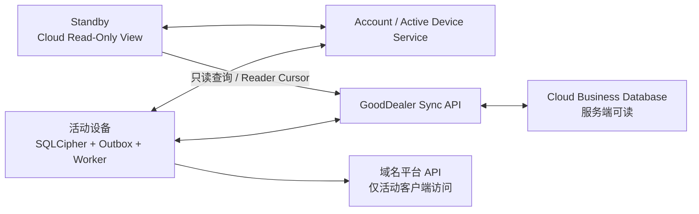

# GoodDealer 账号、设备与云同步

状态：Accepted Design  
更新日期：2026-08-01

## 1. 设计结论

GoodDealer 采用“本地执行 + 强制云同步 + 单执行设备”的混合架构：

- 云同步是产品基础能力，不提供永久关闭同步或纯本地模式。
- 一个账号在 Windows、macOS、iOS、Android 合计最多绑定两台设备。
- 任意时刻只有一台活动设备可以产生 Mutation、读取平台、批准操作和执行外部副作用。
- 另一台绑定设备处于 Standby，可以进入受限的 Cloud Read-Only View，查看服务端已有业务数据、告警和任务进度，但不能修改业务数据或访问平台。
- 活动设备正常在线时持续续签 ActiveDeviceLease；GoodDealer 云不可用时，凭预签发许可继续执行平台操作最多 24 小时。
- 域名资产和非秘密业务数据同步到 GoodDealer Sync Service，服务端可以读取、查询和处理。
- API Key、OAuth Token、Cookie、密码、平台 2FA、Auth Code、Browser Profile 和数据库密钥不得上传服务端。
- 本地 Backup/Restore 提供用户主动操作的加密备份文件导出与恢复。
- 同步到服务端不等于公开展示；未来资产展示必须由用户显式发布。

用户可以临时离线，Mutation 保存在本地 Outbox，恢复联网后继续同步；“离线”不是一个可永久选择的产品模式。

## 2. 数据分类

### 2.1 强制同步、服务端可读

- `DomainAsset`、`OwnershipEpisode`、`RegistrarBinding`。
- 域名、注册商、到期时间、Nameserver、持有和续费状态。
- Portfolio、标签、备注、购入成本、目标售价和币种。
- Marketplace Listing、价格、上下架状态、销售状态和佣金规则。
- Desired/Observed State、字段基线和冲突记录。
- DNS Zone 与非敏感 DNS Record。
- 脱敏后的所有权验证方式、状态、有效期、最后检查时间、错误分类和完成结果。
- ProviderConnection 的平台、账户别名、远端账户 ID、能力和状态。
- 已脱敏的 Operation 计划、状态、错误分类和审计摘要。
- API 配额范围、剩余量、重置时间、`backoff_until` 和最近刷新时间。
- UI 偏好、保存的筛选器和不包含秘密的自动化设置。

这些数据通过 TLS 传输，在服务端按账号/Workspace 隔离。它们不是端到端密文，GoodDealer 服务端有能力读取。

### 2.2 默认不同步、仅设备本地

- API Key、API Secret、OAuth Access/Refresh Token。
- 平台密码、平台 2FA、恢复码、CAPTCHA 和域名转移 Auth Code。
- 浏览器 Cookie、Local Storage、Browser Profile 和登录会话。
- OS Keychain 中的 `credentialRef` 实际值。
- SQLCipher Master Key、Recovery Secret 和本地完整性密钥。
- 备份口令和备份解密密钥。
- 原始 HTTP Header、未脱敏 URL/Query、完整页面 DOM 和可能含 Token 的原始响应。
- 连接器标记为 `sensitive` 的临时 DNS 验证值或未公开挑战值。

平台凭据不随云端业务数据跨设备同步。某设备此前配置的凭据可以在 Standby 加密保留，但只能在该设备切回 Active 后执行本机健康检查；检查通过后才可复用。新设备、本机检查失败或无法验证、凭据已撤销、丢失、过期时，用户必须重新输入、重新登录，或从用户明确授权的加密备份恢复。Standby 不能读取、健康检查或注入凭据。

### 2.3 字段分类

```text
PUBLIC_BUSINESS      可同步、服务端可读
SENSITIVE_BUSINESS   可同步，但限制员工访问和日志
DEVICE_SECRET        不得离开设备
DIAGNOSTIC_LOCAL     默认仅本地，提交支持请求时另行授权
```

Secure Host 必须在写入 Sync Outbox 前移除 `DEVICE_SECRET` 和未授权诊断数据。

## 3. 账号、绑定与活动设备

应用涉及三种不同凭证：

- `AuthSession`：在线账号请求。
- `OfflineDeviceLease`：证明设备已绑定且在授权离线宽限内。
- `ActiveDeviceLease`：证明本设备是当前唯一执行设备，并允许业务 Mutation、平台读取、操作批准和执行。

数据模型：

```text
DeviceBinding
  device_id
  account_id
  platform
  device_name
  status: bound | removed
  signing_public_key
  signing_key_id
  signing_key_version
  signing_key_status: active | rotated | revoked
  credential_epoch
  bound_at
  removed_at
  last_seen_at

DeviceSwitchRequest
  request_id
  account_id
  from_device_id
  to_device_id
  mode: normal | forced
  status: requested | draining | waiting_expiry | bootstrapping | completed | cancelled | failed
  idempotency_key
  requested_at
  bootstrap_expires_at

ActiveDeviceLease
  account_id
  device_id
  lease_epoch
  issued_at
  renew_after
  online_expires_at
  offline_execute_until
  signature
```

约束：

- 每个账号最多两个 `bound` 设备，所有桌面和移动平台共用额度。
- 服务端同一账号只能存在一个当前 `lease_epoch` 和 `active_device_id`。
- 同一账号最多存在一个未完成的 DeviceSwitchRequest 和一个与之绑定的短期 Bootstrap Capability；重复请求按幂等键返回原请求，禁止两台 Standby 竞争激活。
- ActiveDeviceLease 使用服务端签名并保存在 OS Keychain/Credential Manager。
- `offline_execute_until = issued_at + 24 小时`，在线续签时滚动延长。
- Standby 只能获得 `account:manage` 和 `workspace:read`；不得获得 `workspace:mutate`、`platform:read`、`platform:write` 或 `operation:approve`。
- Standby 可以使用可丢弃的只读缓存和 Reader Cursor，但不能创建 Outbox、Desired State、DeviceCredentialBinding 或 ApprovedOperation。
- 旧 Epoch 设备降级为 Standby 后，可以通过独立的 `execution-facts:ingest` 与 `recovery-candidates:ingest` 通道上传本机已经持久化、可验签的 LateExecutionEvent 和旧修改候选；这两个 Scope 不属于 `workspace:mutate`，不能创建新的 Desired State 或平台副作用。
- Standby 只读缓存使用 SQLCipher 或等效静态加密，独立缓存密钥保存在 OS Keychain/Credential Manager；设备此前作为 Active 配置的 DeviceCredentialBinding 可以继续加密保留，但 Standby 无权调用。
- 设备激活要求应用版本支持当前 Workspace `schema_version`；不支持时禁止激活并提示先升级应用。
- 第三台设备必须先移除旧设备后才能绑定。

### 3.1 设备身份生命周期

- 设备签名算法固定为 Ed25519；私钥由 Rust Secure Host 生成并保存在 OS Keychain/Credential Manager，普通 TypeScript、Cloud 与备份永不获得。
- 首次绑定在已重新认证的账号 Session 下创建一次性、短期 `DeviceBindingChallenge`，绑定 Challenge ID、账号、设备、Purpose、Nonce、候选 Key ID/公钥 Fingerprint、期望 Key Version 和重新认证证明。服务端只在验证新钥 PoP 后原子消费 Challenge 并创建 `bound(v1)`。
- 正常轮换创建绑定当前版本的 Rotation Challenge，并要求旧钥与新钥对同一版本化、长度定界、域分离 Transcript 双 PoP；服务端通过 CAS 在同一事务中把旧版本标记为 `rotated` 并创建 `active(vN+1)`。
- 旧钥丢失不能降级为单新钥轮换；必须进入 Recovery/Rebind，重新认证账号并撤销旧设备 Session、OfflineDeviceLease、ActiveDeviceLease、未消费 Challenge 和签名能力。
- 移除设备把状态置为 `removed`、推进 `credential_epoch` 并记录服务端生效时点。撤销后到达的 LateExecutionEvent 只有在预先签发的操作授权、Key Version、Lease Epoch、可信时间界限和 JTI/序列均可验证时才作为迟到事实处理；设备自报时间不能单独证明撤销前已发生。

公开 Challenge/Proof DTO 由 `protocol/devices` 拥有；Cloud `devices` 拥有 Challenge、DeviceBinding、版本 CAS 和撤销事实；Rust `device-identity` 拥有私钥、Transcript 和签名 Port。完整决策见 [ADR-0011](adr/0011-device-identity-lifecycle.md)。

## 4. 设备切换

### 4.1 正常切换

1. Standby 设备以幂等键请求“切换到此设备”，服务端创建账号级互斥的 DeviceSwitchRequest。
2. 当前活动设备收到切换请求，停止领取新任务。
3. 当前原子请求完成或进入 `outcome_unknown`，随后上传 Outbox 和最新 Cursor。
4. 当前设备请求释放 ActiveDeviceLease，并附带本机最后一个 `client_sequence`。
5. 服务端核对已接收序列与设备申报一致（排空验收）后释放旧 ActiveDeviceLease、递增待激活 Epoch，并向目标设备签发绑定该 DeviceSwitchRequest 的短期只读 Bootstrap Capability；不一致时拒绝进入 Bootstrap，要求继续上传。
6. 新设备校验应用版本支持当前 Workspace `schema_version`，使用 Bootstrap Capability 拉取最新 Revision、建立完整本地工作库并强制执行一轮一致性校验；原只读缓存不作为 Mutation 基线。
7. 新设备提交摘要和支持的 Schema 版本，服务端核验后原子签发 ActiveDeviceLease 并完成 DeviceSwitchRequest；在此之前 Cloud 和 Rust Host 均不授予 Mutation、平台读取/写入或批准能力。

### 4.2 强制切换

当前活动设备丢失、关机或不可达时：

- Standby 可以申请强制切换，但必须等旧 Lease 的 `offline_execute_until` 到期。
- UI 显示最早可接管时间和旧设备最后在线时间。
- 等待期间 Standby 仍可查看云端资产和风险告警；紧急情况提供平台官网手工处置入口，事后由新活动设备重新读取并对账。
- 到期后服务端递增待激活 Epoch，向目标设备签发短期只读 Bootstrap Capability；重建和摘要校验通过后才原子签发 ActiveDeviceLease。
- 旧设备重新连接时发现 Epoch 过期，立即停止 Worker。若设备仍为 `bound` 且 License 有效则降级为 Standby；设备已移除、授权失效或完整性校验失败才进入 Locked。
- 降级后的旧设备使用独立 Ingest 上传 LateExecutionEvent 和 StaleDeviceCandidate；上传不能恢复旧 Epoch 的执行权，也不能写当前 Workspace。

外部域名平台不理解 GoodDealer Epoch，因此不能同时承诺旧设备无限离线执行和新设备立即安全接管。24 小时是已确认的可用性与切换速度折中。

## 5. 云同步架构



本地修改流程：

1. 活动设备在本地事务中修改领域实体。
2. 同一事务写入 Sync Outbox Mutation。
3. UI 立即读取本地结果。
4. Sync Worker 批量上传 Mutation。
5. 服务端验证账号、活动设备 Epoch、Schema、权限和 `base_revision`。
6. 服务端提交新 Revision并返回服务器序号。
7. 以后切换到另一台设备时，按 Cursor 增量拉取并重建本地状态。

禁止上传或下载整个 SQLite/SQLCipher 数据库、WAL 或应用数据目录。云端使用正规化业务 Schema 与 Mutation Log。

Standby 读取流程不属于平台同步：它只查询 GoodDealer Cloud 已有数据，不调用连接器、不刷新外部平台，也不产生 Sync Mutation。只读缓存可以随时清除；设备激活时必须以当前 Server Revision 建立正式工作副本。

## 6. 同步时机与触发器

同步协议之外，何时同步是独立的设计约束：单执行设备架构下，云端的新鲜度完全取决于活动设备的上传时机。

总原则：周期同步保证最终一致，事件驱动同步保证关键时刻；可阻塞的不可逆状态迁移以冲刷成功为前置条件。

### 6.1 事件驱动上传

- 本地事务提交是正确性来源：领域实体与 Outbox Mutation 同事务落库，上传是异步传播，不是一致性依赖；本地写入永不等待服务端确认。
- Mutation 落库后在短去抖窗口（建议 2～5 秒）内批量上传；批量操作合并为批次请求，不逐条往返。
- 应用打开期间保持周期兜底冲刷（建议 30～60 秒）。
- 断网时 Outbox 只增不减，恢复联网后按序续传。

### 6.2 强制冲刷点

强制冲刷点分为两级：

阻塞型——冲刷失败时阻塞对应状态迁移，不得跳过：

- 设备切换释放 ActiveDeviceLease 前（见 4.1 排空验收）。
- Schema 迁移开始前。
- 创建本地加密备份前，保证备份 Manifest 中的 Server Revision 与内容一致。

尽力型——立即尝试冲刷，失败不阻塞该事件，Outbox 本地持久保留并在下一时机续传：

- 应用退出、挂起或 OS 休眠前。
- 移动端切入后台时立即冲刷，不依赖后台定时器。
- License 离线宽限结束、客户端锁定前；冲刷失败不推迟锁定，未同步增量待恢复授权后先行上传。
- 恢复网络连接时。

### 6.3 上传优先级

Outbox 不是单一 FIFO。Operation 执行结果、Sold/所有权状态变化和审计摘要优先于标签、备注、UI 偏好等低价值修改上传。

### 6.4 拉取策略

单执行设备使云端在活动期间几乎不产生本设备之外的新内容，拉取策略是不对称的：

- 活动设备：激活时阻塞式基线对齐（见 4.1），每次上传后确认新 Revision，另以低频周期（建议 5～15 分钟）拉取网页端删除请求、合规 Tombstone 等服务端来源事件。
- Standby：打开 Cloud Read-Only View 时立即拉取，视图停留期间周期刷新（建议 30～60 秒），支持手动刷新；全部经 Reader Cursor 增量读取。

### 6.5 Lease 续签搭载同步进度

ActiveDeviceLease 续签请求携带本设备最后上传的 `client_sequence`。服务端据此持续掌握云端落后活动设备的修改数，用于：

- Standby 视图显示“活动设备有 N 条修改未同步”。
- 强制切换等待界面预估接管后将进入恢复中心的旧修改规模。

### 6.6 失败、退避与残余风险

- Sync API 返回 429/5xx 时指数退避；阻塞型冲刷点的失败阻塞对应迁移并向用户说明原因。
- 活动设备 UI 常驻显示未同步修改数与最后成功同步时间。
- 已接受的残余风险：活动设备在未同步增量上传前永久损失（磁盘损坏、被盗且无备份）时，该增量不可恢复。以冲刷节奏、未同步计数提示和本地备份引导收窄该窗口，不承诺为零。

日志分类、回放边界与一致性校验见 [SYNC_SEMANTICS.md](SYNC_SEMANTICS.md)；Mutation Log Checkpoint 与保留策略见 [DATA_LIFECYCLE.md](DATA_LIFECYCLE.md)。

## 7. 云同步与执行数据模型

```text
Workspace
  id
  account_id
  schema_version
  server_revision

SyncMutation
  mutation_id
  workspace_id
  entity_type
  entity_id
  base_revision
  changed_fields
  source_device_id
  active_lease_epoch
  client_sequence
  server_revision

DeviceCursor
  workspace_id
  device_id
  last_pulled_revision

ReaderCursor                  # Standby 可丢弃只读游标
  workspace_id
  device_id
  last_read_revision

ProviderConnectionShared
  id
  provider
  account_alias
  remote_account_id
  capabilities
  quota_scope
  rate_limit_state
  backoff_until

DeviceCredentialBinding       # 仅客户端
  provider_connection_id
  device_id
  provider
  credential_namespace
  credential_profile_id
  credential_profile_version
  slots[]
    slot_id
    secret_kind
    credential_ref
  credential_health

BrowserSessionProfile         # 仅客户端，由 browser-automation 拥有
  device_id
  provider_connection_id
  session_mode: persistent | private
  profile_ref
  session_health

ApprovedOperation             # 活动设备本机生成
  operation_id
  plan_hash
  executor_device_id
  active_lease_epoch
  approved_actions
  approved_at
  expires_at
  device_signature

LateExecutionEvent            # 旧 Epoch 既成执行事实
  event_id
  operation_id
  source_device_id
  active_lease_epoch
  client_sequence
  event_type
  evidence_level
  occurred_at
  received_at
  payload_redacted
  device_signature
```

`mutation_id` 全局唯一并幂等。云端同步状态不能直接产生外部副作用；Worker 只执行本机签名有效、Epoch 匹配且未过期的 ApprovedOperation。

`LateExecutionEvent` 使用独立的追加式 Execution Event Ingest，不经过 SyncMutation，也不要求上传时仍是当前 Epoch。服务端验证事件对应的 Lease 在动作发生/开始时仍处于 `offline_execute_until` 内，并结合最后可信时间锚点、单调时钟增量、设备序列号和签名判断；上传延迟本身不能丢弃合法事实。无法证明发生时间或授权范围的报告保留在安全隔离区，并要求当前活动设备对账。

## 8. 平台读取与写入

### 8.1 读取协调

- 只有活动设备执行外部平台读取，Standby 只能读取 GoodDealer Cloud 已有快照，不运行任何平台后台刷新。
- P2/P3/P4 刷新全部由活动设备执行。
- 切换设备时同步非秘密限流摘要，新设备继承 `backoff_until`，不能立即重复全量刷新。
- 连接器声明 `quotaScope: credential | provider_account | provider_global | unknown`。
- 平台返回的 Rate Limit Header 和 429 更新云端共享状态；API Key 本身不上传。

### 8.2 外部写入

- 不再为每个 Operation 申请跨设备执行租约。
- Worker 执行前校验 ActiveDeviceLease、`lease_epoch`、ApprovedOperation 签名和本地资源锁。
- GoodDealer 云可用时持续续签 Lease 并正常同步结果。
- GoodDealer 云不可用但 `offline_execute_until` 未到期时，活动设备可以继续平台写入；结果标记 `uncoordinated_execution` 并进入 Outbox。
- 24 小时许可到期后，可以继续本地查看、编辑和准备计划，但暂停新的平台读取与写入。
- 云恢复后先上传未协调结果、确认 `outcome_unknown` 并重新对账，再执行新任务。

## 9. 过期 Epoch 的事实与修改

正常切换前必须上传 Outbox，因此通常不会产生设备并发冲突。

强制切换后，旧设备可能同时保留已经发生的执行事实和尚未同步的业务修改。两者不得共用 Candidate 通道。

### 9.1 LateExecutionEvent：不可丢弃的既成事实

- Operation 请求尝试、远端任务 ID、平台响应、确认等级、`succeeded/failed/outcome_unknown` 和审计事件作为 `LateExecutionEvent` 追加保存。
- 服务端验证来源设备曾持有对应 Epoch、ActiveDeviceLease 和 ApprovedOperation 签名有效、计划 Hash 匹配、Event ID/序列号未重放。
- 验证通过的事件即使在切换后才上传也不能由用户丢弃；无效或无法验证的报告进入安全隔离记录，不进入业务事实流。
- LateExecutionEvent 只补全操作历史和审计证据，不直接覆盖当前 Desired/Observed State，也不能触发新的平台副作用。
- `outcome_unknown` 必须保留到当前活动设备通过平台读取、报告文件或用户确认得到权威结果。
- 旧设备的执行事实入库后，当前活动设备优先执行远端对账；手工或离线期间的实际变化最终作为新 Observed State 收敛。

### 9.2 StaleDeviceCandidate：可选择的旧修改

- 带旧 `active_lease_epoch` 的 Desired State、价格目标、标签、备注、Portfolio 等可变业务修改不直接写入当前 Workspace。
- 服务端把这些字段差异保存为 `StaleDeviceCandidate`；执行事实和审计事件绝不进入 Candidate。
- 当前活动设备在恢复中心查看云端当前值、旧设备值和原始基线。
- 用户选择重新应用的字段后，基于当前 Server Revision 生成新 Mutation。
- Sold、Nameserver、DNS 删除、所有权和价格等高风险字段不能批量静默恢复。

## 10. 备份恢复语义

恢复备份不能静默回滚云端：

1. 把备份恢复到隔离 Staging Database。
2. 校验 Workspace、Schema、备份时间和备份 Server Revision。
3. 拉取当前云端状态，云端作为当前业务基线。
4. 备份中的业务差异生成 `RestoreCandidate`，不直接生成 Mutation。
5. 用户逐项或按安全字段选择重新应用；选中项基于当前 Revision 生成新 Mutation。
6. 平台凭据等本地数据可以在当前设备单独恢复，不参与云端覆盖。
7. 旧 Operation 只恢复历史摘要，不能重新入队。

云端不可用时，备份只能打开在隔离只读区；不能替换当前同步库。只有明确创建全新 Workspace 时，才允许以备份业务数据初始化云端。

## 11. GoodDealer 账号安全

采用消费级账号安全，不引入强制 2FA、TOTP 或企业组织策略：

- 邮箱验证和安全的密码哈希。
- 登录、注册、密码重置和验证码接口限流。
- 可选 Passkey。
- 账号网页端提供会话和绑定设备列表，可远程退出/移除。
- Refresh Token 轮换和旧 Token 复用检测。
- 密码重置撤销现有在线 Auth Session。
- 新设备绑定、密码修改、数据导出和设备移除发送邮件通知。
- 删除账号、导出数据、移除活动设备时要求重新输入密码；启用 Passkey 的用户可以用 Passkey 确认。

不提供 GoodDealer TOTP、强制第二因素或恢复码体系。平台自身的密码、2FA 和 CAPTCHA 仍由用户在平台页面处理。

### 11.1 GoodDealer Staff 管理访问

内部管理员使用独立 StaffIdentity 和 Admin API，不复用用户账号 Session。普通用户“不强制 2FA”的决定不适用于 Staff；首版只有一名管理员（Owner），正式环境强制 Passkey。Role/Scope 结构保留但首版只签发 Owner 身份，未来增加 Staff 时再启用角色细分。

- Owner 默认查看账号、设备、License 和健康摘要；读取跨账号域名业务明细必须具备对应 Scope，并记录理由/外部工单 CaseReference 和 Staff AuditEvent，不要求用户逐次授权。
- Owner 可以诊断 Mutation、Cursor、Checkpoint、Candidate、Execution Ledger 隔离区和 Jobs，但不能创建用户 Mutation 或代表用户访问平台。
- 所有 Admin 查询和修改通过模块显式 Admin Application Port。高风险动作要求 Passkey 重新认证；异步动作持久化 actor、Scope 快照、理由/CaseReference、重新认证时间、幂等键和前后摘要。
- 单 Owner 首版不做多人审批；目标模块仍拥有具体 Repair Command，禁止万能 Admin Command、直接业务 Repository 或任意 SQL。
- Cloud 从未持有的平台凭据、Cookie、Browser Profile、数据库密钥和本地备份秘密对管理员同样不可见。

## 12. License 过期与合规入口

订阅和离线宽限结束后，客户端不进入业务主界面，也不允许客户端查看、导出、备份或执行平台操作。

账号网页端不属于授权业务功能，过期后仍提供：

- 服务端持有业务数据的机器可读导出（JSON/CSV/ZIP）。
- 账号与云端数据删除请求。
- 会话、绑定设备和账号安全管理。

网页导出不包含服务端从未持有的 API Key、Cookie、Browser Profile、本地 Artifact 或数据库密钥。导出和删除需要重新认证、限流、审计和邮件通知。

## 13. 终身授权与停服预案

终身 Entitlement 覆盖所有未来大版本，但日常运行仍使用有限期 OfflineDeviceLease 和 ActiveDeviceLease。

GoodDealer 承诺：如永久停止运营，将向终身用户及停服时订阅有效的用户提供最终本地延续版本或永久离线凭证，使其可以访问、导出本地数据并继续设备本地的平台操作。

实施要求：

- 使用与日常 License 私钥分离的离线 Sunset Signing Key。
- 最终版本支持 `LocalContinuationMode`，取消账号、设备 Lease 和云同步依赖。
- 停服前提供云端全量业务数据下载。
- Sunset Entitlement 和最终安装包通过多个静态渠道发布并签名。
- 商业条款明确该承诺、适用用户和可继续使用的最后版本。

## 14. 未来域名资产展示

同步数据属于账号私有 Workspace。未来展示功能使用独立 Publication Projection：

- 用户显式选择公开域名、价格、落地页和联系入口。
- 未选择的域名、成本、备注、连接账户、冲突和审计保持私有。
- 发布、更新和下线都有预览与审计。
- 公开页面不直接查询完整 Workspace。

## 15. 本地加密备份

- 创建、导出、选择文件和恢复都由用户主动发起。
- 首版使用一种版本化加密备份包，不引入独立 Credential Vault 工件。用户可以通过默认关闭的“包含平台 API 凭据”开关，将允许迁移的 API/OAuth 凭据区段写入同一备份；Manifest 必须明确记录范围。
- 永不包含项以 [D-013](OPEN_DECISIONS.md#d-013-本地备份中的平台凭据) 和 [DATA_LIFECYCLE.md](DATA_LIFECYCLE.md) 的 Backup Content Manifest 为单一事实源，包括 Browser Profile/Cookie/Local Storage、设备签名私钥、ApprovedOperation、AutomationExecutionTicket、GoodDealer Auth/Entitlement/OfflineDeviceLease/ActiveDeviceLease、数据库 Master Key 明文、Recovery Secret、备份口令/解密密钥；OS Keychain 元数据不随凭据迁移。
- 导出路径由系统文件选择器决定，用户自行保管文件。
- GoodDealer 不集成第三方远程备份服务。
- 云同步不能替代备份；误删除可能同步到所有设备。

## 16. 验收要求

- 所有平台合计最多绑定两台设备，任意时刻只有一台活动设备。
- Standby 可以进入 Cloud Read-Only View 查看服务端资产、告警和任务进度，但不能产生 Mutation、读取外部平台、批准或执行任务。
- 正常切换先清空 Outbox，服务端排空验收通过前不得递增 Epoch；强制切换必须等待旧设备 24 小时许可到期。
- 活动设备常驻显示未同步修改数；Standby 显示云端数据截至时间和活动设备未同步计数。
- 激活设备的应用版本必须支持当前 Workspace `schema_version`，激活后强制执行一轮一致性校验。
- 云故障期间，当前活动设备可以继续平台操作最多 24 小时。
- 服务端不存在 API Key、OAuth Token、Cookie、Auth Code 或 Recovery Secret。
- 切换设备后不会立即重复后台刷新，并继承平台退避状态。
- 旧 Epoch 执行事实必须追加保存且不可丢弃；旧 Epoch 可变修改和备份旧值都不能静默覆盖云端。
- License 过期后账号网页端仍能导出服务端数据和申请删除。
- 可选 Passkey 正常工作，但产品不要求 GoodDealer 2FA。
- Staff Admin 使用独立 Session 与 Scope；Public Session 不能访问 Admin API，管理员不能读取平台秘密或创建用户平台副作用。
- 未显式发布的资产不会出现在公开接口。
