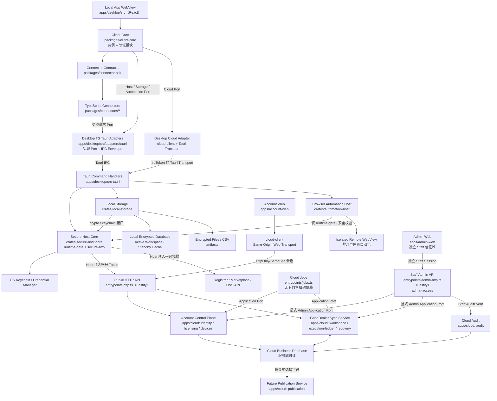

# GoodDealer 系统架构

状态：Draft  
更新日期：2026-08-01

## 1. 架构结论

GoodDealer 采用本地执行、云端业务数据同步的模块化架构：

- Tauri 2 作为 Windows、macOS 及未来移动端宿主。
- TypeScript 承载 UI、应用用例、领域模型和平台适配逻辑。
- Rust/Tauri Host 承载密钥、数据库、受控网络、文件系统、更新和 License 等安全边界。
- 独立的 Remote Browser WebView 承载平台登录和用户授权的网页自动化，不拥有高权限 Tauri Command。
- SQLite/SQLCipher 保存本地资产和任务状态。
- GoodDealer Cloud 保存服务端可读的域名业务数据、Mutation、Revision 和活动设备状态。
- Account Control Plane 处理账号认证、License、最多两台设备绑定、单执行设备协调和更新元数据。
- 独立 Admin Web 与 Staff Admin API 支持账号、License、设备、同步、合规和作业运营；管理员不能获取平台凭据、直接修改用户业务状态或代表用户访问域名平台。
- 本地 Backup/Restore 模块提供用户主动操作的加密备份文件导出和恢复，不集成第三方远程存储。

客户端和 GoodDealer Cloud 第一阶段分别采用模块化单体，而不是微服务。平台连接器按独立包编译进客户端，通过稳定接口注册；服务端不加载平台连接器，不持有平台凭据。

## 2. 运行时分层



本地应用 UI 与远程平台页面是两个不同的 WebView 信任域。UI 和普通 TypeScript 代码不直接读取平台密钥或 GoodDealer 账号 Token。连接器使用设备本地 `credentialRef` 构造请求；cloud-client 只构造不含原始 Token 的类型化 GoodDealer Cloud 请求并解析脱敏响应。Desktop 的两类请求都通过 Tauri Adapter 进入 Rust `secure-http`，由 Host 从系统密钥库取出对应凭据、注入请求并对日志脱敏；Token-bearing 登录/刷新响应也由 Host 直接解析和保存。平台凭据与账号 Token 使用不同的凭据命名空间和 Endpoint Allowlist。

远程平台页面可以执行网站自己的 JavaScript、保存该平台的登录会话并接受自动化操作，但不能访问数据库、密钥库、任意文件、Shell、License 或通用 Tauri IPC。网页自动化规则详见 [BROWSER_AUTOMATION.md](BROWSER_AUTOMATION.md)。

Admin Web 不复用 account-web 登录态。首版 Owner 使用独立 StaffIdentity、强制 Passkey、Scope 和 Staff 审计；只调用模块显式公开的管理 Port，不直接访问业务 Repository 或跨模块 SQL。Role/Scope 为未来 Staff 扩展保留，首版不做多人审批。管理员后台不得创建用户 SyncMutation、ApprovedOperation 或平台请求。

应用启动先进入 Account Gate。账号会话或 Offline Device Lease、设备绑定和 Entitlement 有效后，设备可以进入与权限匹配的界面。持有 ActiveDeviceLease 的设备挂载完整 SQLCipher 工作库、Outbox、连接器和 Worker；Standby 只挂载 Cloud Read-Only View，通过只读 API 和可丢弃缓存查看服务端已有数据。域名业务数据可以同步为服务端可读记录；数据库解密密钥、平台凭据和浏览器会话不得进入 Account/Sync Service。

## 3. 领域模块

| 模块 | 职责 |
| --- | --- |
| Portfolio | 域名标准化、资产状态、标签、成本和注册商绑定 |
| Registration | 到期、续费、锁定、联系人、Nameserver 和转移状态 |
| DNS | Zone、DNS Record、DNSSEC、TTL 和冲突保护 |
| Marketplace | Listing、价格、上下架、分期、销售和平台状态 |
| Pricing | 基准价、净收入、佣金、币种和平台定价规则 |
| Verification | TXT/NS 挑战、DNS 传播和平台所有权验证 |
| Sync | 三方状态、字段级差异、读取预算和冲突策略 |
| Cloud Sync | Mutation Outbox、Revision、Device/Reader Cursor、Checkpoint、同步触发器、一致性校验和恢复候选 |
| Operations | 优先级、DAG、资源锁、审批、重试、取消和人工任务 |
| Connections | 平台账户、API/浏览器能力、权限、会话健康和密钥引用 |
| Browser Automation | 隔离登录会话、用户授权、网页脚本和接管/暂停 |
| Account & Licensing | 登录门禁、本地会话、授权状态、两台绑定、单执行设备和 Standby 只读权 |
| Active Device Coordination | ActiveDeviceLease、Lease Epoch、24 小时离线许可和设备切换 |
| Publication | 未来用户显式发布的域名资产投影，与私有 Workspace 隔离 |
| Backup & Restore | 本地加密备份文件导出、校验、版本迁移与恢复 |
| Audit | 应用层只追加的 AuditEvent、完整性校验、错误和敏感信息脱敏；LateExecutionEvent 由 Operations/execution-ledger 独立拥有 |

模块只能通过公开应用接口通信，禁止跨模块直接修改数据库表。

每个领域模块到 client-core、本地持久化、安全 Host/Rust 和 Cloud 模块的工程归属见 [ENGINEERING_STRUCTURE.md](ENGINEERING_STRUCTURE.md) 的映射表；本表与该映射表必须同步维护。

## 4. 状态模型

系统不把“API 调用成功”等同于“同步完成”。每个可同步对象保存：

- `desired_state`：用户希望平台最终达到的状态。
- `observed_state`：最后一次从平台读取或导入的实际状态。
- `sync_status`：一致、待执行、等待远端、冲突、失败或人工处理。

平台原始响应以脱敏 JSON 快照保存，核心查询字段使用正规化表结构。

具体三方合并与配额策略见 [SYNC_SEMANTICS.md](SYNC_SEMANTICS.md)。

本地实体变更与 Sync Outbox 在同一事务提交。服务端按 `mutation_id` 幂等处理，以 `base_revision` 检测并发修改；客户端使用 Device Cursor 增量拉取。服务端 Revision 只表示 GoodDealer 数据顺序，不等于平台真实状态。

上传由事件驱动并批量执行；设备切换、Schema 迁移和备份创建以冲刷成功为前置条件。同步时机与触发器见 [ACCOUNT_AND_SYNC.md](ACCOUNT_AND_SYNC.md)，日志分类与一致性校验见 [SYNC_SEMANTICS.md](SYNC_SEMANTICS.md)，Checkpoint 与保留策略见 [DATA_LIFECYCLE.md](DATA_LIFECYCLE.md)。

## 5. 操作执行模型

所有外部写操作遵循：

1. 用户提交意图。
2. Planner 读取当前状态和平台能力。
3. 生成逐域名、逐平台的差异计划。
4. 风险策略决定是否需要确认。
5. 事务内写入 Operation 与 Outbox。
6. Worker 从持久队列取出任务。
7. 按平台账户限流并执行。
8. 保存远端结果或异步 Operation ID。
9. 再次读取/导入实际状态完成对账。

单个批次不使用跨平台事务。每个 `OperationItem` 独立成功或失败。

复杂工作流使用带依赖关系的 DAG，并以 Domain、DNS Zone、Listing 和 ProviderConnection 为资源锁。只有持有有效 ActiveDeviceLease 的活动设备可以运行 Worker；外部写操作还必须具有本机签名、Epoch 匹配的 ApprovedOperation。云端同步状态本身不是执行授权。优先级、抢占、取消和结果未知语义见 [OPERATIONS.md](OPERATIONS.md)。

## 6. 任务类型

连接器支持五种执行模式：

```text
IMMEDIATE_API      请求直接返回最终结果
ASYNC_API          返回远端任务 ID，后续轮询
FILE_EXCHANGE      生成文件并导入平台处理结果
BROWSER_AUTOMATION 在用户已登录并授权的隔离 WebView 中执行
MANUAL_ASSISTED    生成明确的人工步骤和完成条件
```

任务状态：

```text
planned -> awaiting_approval -> queued -> running
running -> waiting_remote | waiting_dns | manual_action_required
running -> waiting_user_login | waiting_user_authorization
running -> succeeded | failed_retryable | failed_final
```

## 7. 本地进程设计

桌面首版可以在同一 Tauri 应用内运行 UI 和后台调度器，但任务状态必须全部持久化。关闭窗口时可选择：

- 保持托盘进程继续同步。
- 安全暂停任务，下一次启动恢复。

未来如需高吞吐，可把 Worker 拆成 Tauri sidecar；领域接口和数据库模型保持不变。

桌面版同一数据目录只允许一个 Writer 实例；第二个实例把聚焦或文件打开请求转交给主实例后退出。

## 8. 移动端兼容边界

未来 iOS/Android 共享：

- 领域包、Schema、连接器映射和价格规则。
- 宿主无关的 Port DTO 和 Host Command 能力模型；具体 IPC Envelope 由各宿主 Adapter 定义。
- 大部分页面和状态管理。

移动端需要单独适配：

- Keychain/Keystore。
- 后台任务时间限制。
- 文件导入导出和分享面板。
- 生物识别解锁。
- 大型表格交互。

移动端不承诺首期与桌面完全同功能。Standby 状态优先提供云端查询、告警、计划审阅、设备切换和紧急人工处置引导；正式批准、平台刷新、少量编辑和自动紧急下架仅在移动设备切换为 Active 后提供。

## 9. 运行时模型与工程结构

工程边界必须落实 RuntimeMode，而不是只由 React 隐藏按钮：

| RuntimeMode | 本地存储 | 云端权限 | 平台能力 |
| --- | --- | --- | --- |
| `Locked` | 不打开业务存储 | 登录、续费、设备和合规入口 | 无 |
| `Standby` | 只打开分库分钥的加密只读缓存 | `account:manage`、`workspace:read`；旧 Epoch 事实/候选的窄 Ingest | 无 |
| `Activating` | Standby Cache 保持只读；独立 Staging 校验/恢复 Active 工作库，不允许业务写入 | 仅 Bootstrap Capability：拉取基线、Checkpoint、Mutation 和一致性摘要 | 无 |
| `Active` | 完整 SQLCipher 工作库、Outbox、Queue 和 Artifact | `workspace:mutate` 与 Execution Event Ingest | 平台读取、批准和执行 |
| `Draining(reason)` | 完成当前原子步骤并停止领新任务；`handoff` 必须冲刷，`suspend` 尽力冲刷 | `handoff` 提交最后 `client_sequence` 并等待排空；`suspend` 不要求云端验收 | 仅完成当前原子步骤 |
| `LocalContinuation` | 预留的停服本地延续模式 | 不依赖 GoodDealer Cloud | 按 Sunset Entitlement 本地执行 |

`LocalContinuation` 只为 D-010 永久停服预案预留状态，不是正常版本可选择的纯本地模式。RuntimeMode 的权威状态和命令准入由 Rust `runtime-gate` 与云端 Scope/ActiveDeviceLease 共同决定；TypeScript 只消费状态快照，不能自行提升权限。

工程结构顶层划分：

- `apps/`：desktop（React 壳 + TypeScript Tauri Adapter + 薄 Rust Command Handler）、account-web（用户账号与合规网页端）、admin-web（独立 Staff 后台）、cloud（Public HTTP/Admin HTTP/Jobs 三入口组装的模块化单体）。Phase 0 不创建 mobile 空包，Phase 6 启动时基于宿主无关核心新建移动宿主。
- `packages/`：protocol（唯一跨端协议包，含受导入限制的 admin 子路径）、client-core（宿主无关的客户端用例与领域模块，具体归属由映射表维护）、cloud-client、connector-sdk 与 connectors、browser-automation（仅 TS 契约与 Recipe）、ui、i18n。
- `crates/`：secure-host-core（无 Tauri 依赖的安全核心与 runtime-gate）、local-storage（Active Workspace 与 Standby Cache 分库分钥）、automation-host（Remote WebView 宿主）。

完整目录树、领域模块到工程归属的映射表、依赖规则、存储边界和测试归属以 [ENGINEERING_STRUCTURE.md](ENGINEERING_STRUCTURE.md) 为唯一事实源；结构决策见 [ADR-0006](adr/0006-runtime-and-security-boundaries.md)。

建议使用 pnpm workspace。Tauri 桌面安装包不依赖 Node.js 运行时；Cloud 的 Public HTTP、Admin HTTP 与 Jobs 入口使用受支持的 Node.js LTS。客户端与云端只共享 `protocol` 中的 DTO、校验 Schema、版本转换和确定性 Codec，不共享 SQLite/PostgreSQL Repository、ORM Model、Migration 或数据库访问层。

## 10. 本地与 Cloud 数据接口复用

本地 Active Workspace 与 Cloud Workspace 共享业务词汇、协议 DTO、Mutation Schema、版本转换和确定性摘要 Codec，但不共享 Repository、ORM Entity、Migration 或事务实现。

客户端 UI 通过 client-core 的只读 Query Port 统一 Active 与 Standby 查询：

```text
Active  -> Local Query Adapter   -> Tauri IPC -> local-storage
Standby -> Cloud Query Adapter   -> cloud-client -> workspace/read
```

Composition Root 按 RuntimeMode 注入实现。返回值必须携带来源、Server Revision、最后云同步时间、最后平台读取时间和是否可编辑，避免把 Standby Cloud 数据显示成平台实时状态。

共享 Query Port 只覆盖可同步的非秘密业务投影。凭据健康、Browser Profile、Keychain 状态和本地 Artifact 使用 Active-only Port，不通过大量可空字段伪装成 Active/Standby 通用模型。

写路径不复用：Active Command 必须先在本地事务提交业务状态与 Outbox，再异步上传 Mutation；Standby 没有写实现。Cloud Mutation API 是同步协议，不是 UI 可直接调用的远程 CRUD Repository。详细规则见 [ENGINEERING_STRUCTURE.md](ENGINEERING_STRUCTURE.md) 与 [ADR-0007](adr/0007-admin-boundary-and-interface-reuse.md)。

## 11. 初始技术基线

- Tauri 2
- TypeScript strict mode
- React + Vite
- SQLite/SQLCipher 本地数据库
- TypeScript Cloud API 模块化单体
- Fastify 承载独立的 Public HTTP 与 Admin HTTP Composition Root；Route 校验用的 JSON Schema 从 protocol Zod 构建期派生，Zod 为唯一契约事实源
- Cloud Jobs 使用基于 PostgreSQL 的任务队列（建议 pg-boss），不依赖 Web 框架，延续 PostgreSQL 为正确性来源的原则
- PostgreSQL 云端业务数据库、Mutation Log、ActiveDeviceLease 和 Lease Epoch
- 对象存储用于服务端快照、备份轮转和未来公开页面静态资源
- Zod 用于 Port DTO、TypeScript IPC Envelope、连接器输入和远端响应校验；Rust Command Handler 对 IPC DTO 镜像校验
- TanStack Query 管理查询状态，不作为领域状态源
- Vitest 进行领域和连接器测试
- Rust integration tests 覆盖密钥、数据库和 HTTP Gateway
- automation-host 跨引擎测试覆盖 Profile、脚本投递、IPC、导航、弹窗、下载和失败关闭
- Cloud integration tests 覆盖租户隔离、Standby 只读权限、Mutation 幂等、Revision 冲突、LateExecutionEvent、单执行设备、Epoch 切换、排空验收、Checkpoint 重建和一致性校验
- Admin integration tests 覆盖 Staff Session/Scope、Public/Admin Route 隔离、模块管理 Port 和 Staff 审计
- Active/Standby Query Adapter 契约测试与 protocol/workspace 摘要 Golden Vector
- 桌面端端到端测试覆盖 Windows 与 macOS 打包产物
- TypeScript Project References、Package Exports、Import Boundary Lint 和 Rust 可见性测试执行模块依赖方向

ActiveDeviceLease 初期使用 PostgreSQL 事务、账号级唯一约束、数据库时间和单调递增 `lease_epoch` 实现，不依赖 Redis 作为正确性来源。若以后增加 Redis，只用于通知、缓存和唤醒，当前活动设备和 Epoch 的最终状态仍由持久数据库确认。

数据恢复、域名持有周期、多账户、快照保留和 Schema 迁移见 [DATA_LIFECYCLE.md](DATA_LIFECYCLE.md)。

账号门禁、两台设备、云同步、凭据隔离和本地备份见 [ACCOUNT_AND_SYNC.md](ACCOUNT_AND_SYNC.md)。
