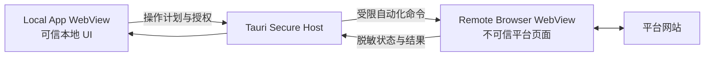

# GoodDealer 浏览器自动化

状态：Draft  
更新日期：2026-08-01

## 1. 目标

对于没有 API、API 权限受限或仍需网页验证的平台，GoodDealer 可以在客户端内打开平台页面，由用户自行登录并授权软件完成后续操作。

浏览器自动化是正式连接器传输方式，不是绕过平台安全机制的手段。

## 2. 双 WebView 模型



### Local App WebView

- 只加载签名应用内的本地资源。
- 可以调用经过授权的 Tauri Command。
- 展示资产、操作计划和审计结果。

### Remote Browser WebView

- 加载平台真实登录和管理页面。
- 保存本地 Cookie 和登录会话。
- 允许用户输入密码、2FA 和 CAPTCHA。
- 没有数据库、密钥库、Shell、任意文件或 License Command 权限。
- 不允许向本地 UI 注入代码或直接调用业务模块。

## 3. 命令投递与结果回传

Tauri 2 不提供 CDP 级浏览器自动化。桌面首版采用 Tauri/Wry 已公开的 WebView 能力：

- Host 到 WebView：使用 `eval_with_callback` 执行一次性 JavaScript Action Probe；需要尽早注入的最小运行时使用 `initialization_script`。
- WebView 到 Host：优先使用 `eval_with_callback` 的 JSON 返回值；若某平台流程需要持续事件，则由专用 Wry IPC Handler 或仅允许 `browser-automation:report` 的窄 Tauri Command 回传。
- 导航边界：使用 `on_navigation`、`on_new_window` 和 `on_page_load` 由 Rust Host 决定是否允许跳转以及何时重新注入。
- 下载边界：使用 `on_download` 把允许的下载重定向到应用私有临时目录。

Remote WebView 不获得通用 `invoke`、事件总线或文件接口。浏览器桥只接受以下消息：

```text
HostActionCommand = automation_execution_ticket + ActionRequest
ActionRequest  = session_id + action_id + sequence + nonce + recipe_step
ActionReport   = session_id + action_id + sequence + nonce + observation
```

AutomationExecutionTicket 只在 Rust Command Handler 与 automation-host 之间传递，校验完成后才构造最小 ActionRequest；Ticket 和 host_authenticator 不得注入远程页面。Nonce 和序列号用于防止旧页面、重复回调和跨会话消息混入，但不能证明页面报告的业务结果真实。

### 结果可信度

所有浏览器结果必须带可信度等级：

| 等级 | 含义 | 可否完成任务 |
| --- | --- | --- |
| `EXECUTED` | 注入脚本报告已点击或填写 | 否 |
| `OBSERVED` | 当前页面出现预期 DOM、URL 或提示 | 低风险读取可用 |
| `PAGE_CONFIRMED` | 重新加载官方结果页后，一次性只读 Probe 读到服务端生成的状态或任务 ID | 一般网页操作可用 |
| `API_CONFIRMED` | 通过独立官方 API、下载报告或其他权威通道确认 | 是，最高等级 |
| `USER_CONFIRMED` | 无独立机器通道时，由用户确认平台实际结果 | 是，但审计中标明人工确认 |

`EXECUTED` 和首次页面回报永远不等于成功。写操作至少需要 `PAGE_CONFIRMED`、`API_CONFIRMED` 或 `USER_CONFIRMED`。

二次页面确认必须使用新的导航或重新加载，并执行新的只读 Probe，不复用第一次动作脚本留下的全局对象。该方式仍不能把远程页面提升为可信源，因此结果必须保留 `PAGE_CONFIRMED` 标签。

### 注入运行时被篡改时的失败模式

- 注入脚本不携带数据库密钥、平台 API Secret 或本地文件内容。
- Action Probe 尽量一次性执行，避免把长期可篡改的运行时挂到页面全局。
- 使用页面指纹、Origin、URL、元素唯一性和前置状态检查；任一不符合即失败关闭。
- Windows 上 `initialization_script` 会进入子 Frame，Recipe 必须再次检查 `window.top === window` 与 Origin。
- 页面可以伪造 DOM 和回调，因此 Host 只把回调视为 Observation，不视为权威提交结果。
- 回调丢失、序号错误、Nonce 不匹配、页面导航或用户接管时，动作进入 `outcome_unknown`，先执行独立确认，禁止直接重试写操作。

## 4. 用户交接流程

连接建立和业务执行是两条不同的授权旅程。

连接建立：

```text
打开平台连接
  -> 软件展示官方域名、用途与会话模式
  -> 用户授予 BrowserSessionConsent
  -> 用户在隔离窗口自行登录/获取 API Key
  -> 软件只检测 Origin 与登录状态
  -> 用户复制或通过安全输入通道保存凭据
  -> Consent 到期或用户关闭窗口
```

业务执行：

```text
已连接且检测到登录状态
  -> 软件生成将要执行的动作计划
  -> 用户选择目标和点击“授权执行”
  -> Secure Host 原子消费批准与 Grant 并签发一次性 Ticket
  -> 软件接管页面操作
  -> 用户可随时暂停并接管
  -> 软件验证成功状态并写入审计记录
```

密码、2FA、恢复码和 CAPTCHA 始终由用户处理。软件不读取输入值，也不将其保存为连接凭证。

## 5. 授权模型

首次登录、获取 API Key 或修复连接使用 `BrowserSessionConsent`：

```text
provider_connection_id
browser_session_id
purpose: login | acquire_api_key | repair_connection
allowed_auth_hosts
session_mode
issued_at
expires_at
```

Consent 只允许 NavigationPolicy 内的导航、用户直接输入和登录状态检测。它不包含 Operation Plan、目标域名或业务动作，不允许自动填写业务字段、上传 Artifact 或触发最终提交。

每次业务执行创建 `BrowserAutomationGrant`：

```text
provider_connection_id
browser_session_id
operation_plan_id
approved_plan_hash
allowed_actions
target_domains
allowed_hosts
issued_at
expires_at
requires_final_confirmation
```

首版只提供单次执行授权：每个 BrowserAutomationGrant 只允许执行其绑定的当前计划。持久 Browser Profile 可以保留登录状态，但不能延长或复用自动化权限；任何后续软件接管都必须重新生成计划、BrowserAutomationGrant 和 ApprovedOperation。

首版不提供会话级、永久或无界的网页操作授权。

### 5.1 AutomationExecutionTicket

普通 TypeScript 不能直接把 BrowserAutomationGrant 解释为执行权限。业务动作开始前：

1. 薄 Rust Command Handler 调用 local-storage，在同一事务中校验并消费未过期的 BrowserAutomationGrant、ApprovedOperation 和当前 DAG Node；普通 TypeScript 不参与该交接。签发前崩溃按失败关闭处理，需要重新批准，不恢复已消费授权。
2. `secure-host-core/operation-signing` 校验 RuntimeMode、设备、Epoch、计划 Hash 和 Recipe Hash，签发短期、一次性的本机 `AutomationExecutionTicket`。
3. automation-host 校验 Ticket 的签名/MAC、单次 Nonce、当前 Browser Session、Origin、Recipe/Step、目标域名和有效期后才投递 Action。
4. Ticket 被使用、过期、用户接管、导航越界或 Session Sequence 变化后立即失效；不得跨设备、跨 Cloud 持久化或做成通用 JWT。

Ticket 至少绑定：

```text
ticket_id
operation_id / workflow_node_id
approved_plan_hash
active_lease_epoch
provider_connection_id
browser_session_id
recipe_id / version / content_hash
allowed_origins / actions / target_domains
artifact_capabilities
required_evidence_level
issued_at / expires_at
single_use_nonce
host_authenticator
```

automation-host 只返回 Evidence/Observation；是否完成 Operation Node 仍由连接器的证据策略与 operations 模块决定。

## 6. 自动化 Recipe

平台脚本应采用受限 Recipe，而不是任意本地代码。Recipe 允许：

- 导航到允许的 HTTPS 页面。
- 按稳定属性查找并验证唯一元素。
- 点击、选择、填写非登录业务字段。
- 上传 GoodDealer 生成并已获授权的文件。
- 读取有限页面状态和下载处理结果。
- 等待导航、提示或平台任务完成。

Recipe 禁止：

- 读取密码、2FA、CAPTCHA 或浏览器密码库。
- 访问任意本地文件。
- 执行 Shell 或通用 Tauri Command。
- 向未授权 Host 上传域名、文件或页面数据。
- 绕过 CAPTCHA、风控、频率限制或平台权限。

必须使用页面可验证状态构造选择器。目标缺失、不唯一或页面版本不兼容时立即停止，不使用坐标猜测最终提交按钮。

## 7. Recipe 更新

网页经常改版，因此自动化规则需要独立版本管理：

- 每个 Recipe 包含 Provider、版本、页面指纹和兼容范围。
- 更新包必须由 GoodDealer 自动化签名密钥签名。
- 客户端在本地验证签名和内容摘要。
- 支持回滚到上一个可用版本。
- Account/License 控制面不参与 Recipe 内容下发。
- Recipe 只能运行受限动作，不能携带任意 Rust、Node.js 或系统代码。

## 8. 会话与 Cookie

- Windows 优先使用独立 `data_directory`；macOS 14+ 使用独立 `data_store_identifier`。更低版本 macOS 的隔离能力必须通过 Phase 0 实测决定支持范围。
- Cookie 只保存在本机，不同步到 GoodDealer 服务端。
- 用户可以查看、退出和清除某个 ProviderConnection 的会话。
- 清除连接时只清除该 `device_id + provider_connection_id + session_mode` Profile 的 Cookie、缓存和临时文件，不影响同平台其他账户。
- 会话过期后状态变为 `waiting_user_login`，不尝试读取或保存用户密码。

客户端无法可靠地对 WebView2/WKWebView 自身数据目录做应用层二次加密。持久 Cookie 的保护依赖 OS 用户隔离与底层浏览器实现，这是明确接受的残余风险；GoodDealer 不声称能抵御已经取得当前 OS 用户权限的恶意进程。

提供两种会话模式：

- 持久会话（默认）：减少重复登录，关闭应用后 Cookie 仍保留。
- 私密会话：使用 Incognito/非持久数据存储，关闭会话即清除；用户每次重新登录。

用户可随时执行“忘记此连接/账户”，调用该 Profile 的 `clear_all_browsing_data` 并删除该连接的临时下载。连接平台时必须明显提供私密会话选项。

## 9. 弹窗、OAuth、下载与上传

### `window.open` 与弹窗

- 使用 `on_new_window` 拦截。
- 已允许 Host 的弹窗创建为同一平台 Browser Session 的子 Remote WebView，继承无高权限 IPC 的 Capability。
- 未识别 Host 不自动打开，先展示目标域名和原因由用户决定。
- iOS/Android 当前不依赖 `on_new_window`，移动端需要另行设计。

### OAuth 与第三方 SSO

- 白名单不是单一 Host，而是每个连接器声明的 `NavigationPolicy`：平台 Host、已知身份提供商和允许的回调 Origin。
- 用户选择 Google、Apple 等登录方式后，临时批准对应身份提供商 Host，授权只在当前登录会话有效。
- OAuth 回调必须回到声明的官方 Origin 或经过登记的自定义 Scheme；未知回调拒绝并交还用户。
- GoodDealer 不读取身份提供商表单内容。

### 下载

- `on_download` 在 Requested 阶段核对 URL、MIME、文件扩展名、预期操作和大小上限。
- 下载目标强制改为应用私有临时目录，完成后计算哈希并注册为 Operation Artifact。
- 用户明确选择“导出到外部”前，文件不复制到 Downloads 等公共目录。
- 如果任一桌面引擎无法可靠拦截特定下载，则该 Recipe 降级为用户保存后手工导入。

### 上传

- Recipe 只能上传当前 Operation 已授权的 Artifact。
- 上传前展示文件名、Hash、目标平台和模式；Afternic Replace Portfolio 必须再次确认。
- Remote WebView 不获得通用文件选择能力或任意路径。

## 10. 可观察性与隐私

- 记录动作类型、页面标识、目标域名和结果，不记录完整页面 HTML。
- 截图和 DOM 诊断默认只保存在本机，并在用户提交支持请求前进行预览。
- 对 API Key、Cookie、邮箱、付款信息和其他敏感文本进行脱敏。
- 远程网页内容不得进入 License、遥测或更新服务。

## 11. 首批场景

### 获取 API Key

- 打开平台官方 API Manager。
- 用户登录和完成安全验证。
- 软件提供页面内步骤提示。
- 用户创建所需最小权限的 Key。
- Key 由用户确认后直接交给 Secure Host 保存；不写入日志或普通前端存储。

### Afternic

- 用户登录 Afternic。
- GoodDealer 打开 Add Domains 页面。
- 用户确认待上传 CSV 和模式。
- 自动上传 CSV 并记录 Upload History 标识。
- 后续读取处理状态和错误项。
- 页面不兼容或出现新的确认步骤时暂停并交还用户。

## 12. Phase 0 可行性闸门

Windows WebView2 与 macOS WKWebView 必须分别验证：

- 独立持久 Profile/数据目录与私密会话。
- 主 Frame 与子 Frame 的脚本注入时机和 Origin 防护。
- `eval_with_callback` 返回值、异常、导航中断和大结果限制。
- 窄 IPC 回传通道无法调用其他高权限 Command。
- `window.open`、OAuth 子窗口、回调和关闭行为。
- 下载拦截、私有目录重定向、上传和文件清理。
- 用户接管、暂停、恢复和窗口崩溃后的失败模式。

只有两个桌面引擎均通过后，`BROWSER_AUTOMATION` 才能进入正式连接器开发。若关键能力不可用，必须评估独立 Chromium 自动化 Sidecar、系统浏览器扩展或维持人工流程，不能继续假设 Tauri WebView 足够。

## 13. 测试要求

- 使用本地 HTML Fixture 测试所有页面状态。
- 测试目标元素不存在、重复和文本变化。
- 测试跨 Host 跳转、弹窗、下载和上传。
- 测试用户暂停、接管和恢复。
- 测试 Recipe 签名、过期和回滚。
- 测试 Remote Browser WebView 无法调用高权限 Tauri Command。

## 14. 官方实现依据

- [Tauri WebviewWindow：eval_with_callback 与浏览数据](https://docs.rs/tauri/latest/tauri/webview/struct.WebviewWindow.html)
- [Tauri WebviewWindowBuilder：脚本、数据存储、弹窗与下载](https://docs.rs/tauri/latest/tauri/webview/struct.WebviewWindowBuilder.html)
- [Tauri Capabilities：按 Window/WebView 限定权限](https://v2.tauri.app/security/capabilities/)
