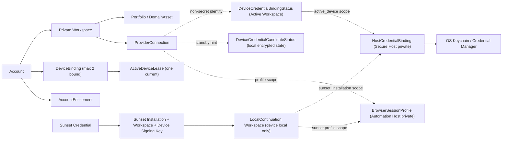
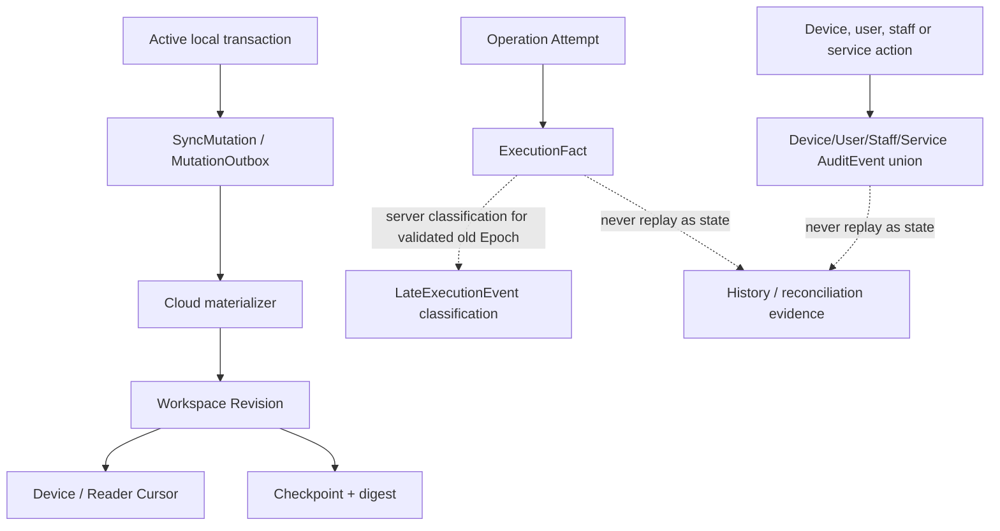
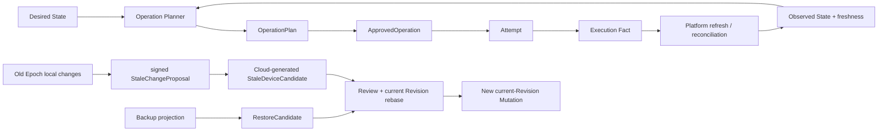

# GoodDealer 数据关系与所有权地图

状态：Derived Navigation Map
更新日期：2026-08-05

## 1. 边界

本文件只描述跨模块关系、信任边界和权威所有者，不复制实体字段、状态转换或数据库 Schema。字段和行为必须回到链接的专题文档；Repository、Migration 和 Wire Contract 仍由 [工程结构](ENGINEERING_STRUCTURE.md) 指定的模块拥有。实现变化若改变聚合关系、所有者或跨边界数据流，必须同步更新本图。

## 2. 账号、设备、Workspace 与平台连接

| 关系或聚合 | 权威所有者 | 主要事实源 |
| --- | --- | --- |
| Account、AuthSession、账号安全状态 | Cloud `identity` | [账号与同步](ACCOUNT_AND_SYNC.md)、[License](LICENSING.md) |
| AccountEntitlement 与支付事实投影 | Cloud `licensing` | [License](LICENSING.md)、[用户旅程 JD-09](USER_JOURNEYS.md#7-产品决策状态) |
| DeviceBinding、Challenge、签名 Key 版本、撤销 | Cloud `devices`；私钥由 Secure Host 拥有 | [ADR-0011](adr/0011-device-identity-lifecycle.md) |
| DeviceSwitchRequest、Bootstrap Capability、ActiveDeviceLease | Cloud `devices/workspace` 编排 | [账号与同步](ACCOUNT_AND_SYNC.md) |
| Workspace、Portfolio、DomainAsset、ProviderConnection | Cloud Workspace 模块与 Active 本地投影 | [架构](ARCHITECTURE.md)、[工程结构](ENGINEERING_STRUCTURE.md) |
| LocalContinuation Workspace、Sunset 本地 Desired/Observed/Base/冲突 | 设备 `local-storage/local-continuation-workspace`；没有 Cloud/Mutation 对端 | [License](LICENSING.md)、[工程结构](ENGINEERING_STRUCTURE.md) |
| DeviceCredentialBindingStatus | Device Active Workspace；仅脱敏状态与 fingerprint | [数据生命周期](DATA_LIFECYCLE.md) |
| DeviceCredentialCandidateStatus | 普通本机加密状态；Standby 仅显示非秘密存在性提示 | [数据生命周期](DATA_LIFECYCLE.md) |
| HostCredentialBinding、credentialRef 和秘密材料 | Device `secure-host-core` / OS Secret Store；strict scope 判别 Active device 或 Sunset installation，namespace 互斥 | [数据生命周期](DATA_LIFECYCLE.md)、[ADR-0009](adr/0009-endpoint-capability-registry.md) |
| BrowserSessionProfile、Profile 目录、health/generation/sequence | Device `automation-host` 私有存储；strict scope 判别 Active device 或 Sunset installation | [浏览器自动化](BROWSER_AUTOMATION.md)、[数据生命周期](DATA_LIFECYCLE.md) |

Cloud 可以保存日常 ProviderConnection 的非秘密业务身份，但不能保存 LocalContinuation Workspace、DeviceCredentialBindingStatus、DeviceCredentialCandidateStatus、HostCredentialBinding、BrowserSessionProfile、credentialRef/Profile Ref 实际值或平台秘密。Standby 只可读取 CandidateStatus 提示；Active HostBinding 只有重新成为 Active 且其他 Gate 通过后才能使用，Sunset HostBinding 只能由匹配的 LocalContinuation 安装 scope 使用，两者不能互换。

## 3. 三类追加记录必须分流

| 记录类别 | 可回放为业务状态 | 去重/顺序所有者 | 保留与恢复边界 |
| --- | --- | --- | --- |
| SyncMutation | 是 | Workspace Sync | 可由 Checkpoint + 后续 Mutation 重建；压缩受 Cursor/Candidate 基线约束 |
| ExecutionFact（可由服务端增加 LateExecutionEvent 分类） | 否 | Operations / execution-ledger | [账号与同步](ACCOUNT_AND_SYNC.md) |
| DeviceAuditEvent / UserAuditEvent / StaffAuditEvent / ServiceAuditEvent | 否 | Audit / admin-access | [安全模型](SECURITY.md)、[账号与同步](ACCOUNT_AND_SYNC.md) |

详细合并和回放语义由 [同步语义](SYNC_SEMANTICS.md)、[账号与同步](ACCOUNT_AND_SYNC.md) 和 [操作语义](OPERATIONS.md) 拥有。

## 4. Desired、Observed、执行与候选

本图只导航对象关系。Desired/Observed、批准与副作用规则以 [操作语义](OPERATIONS.md) 为准；Candidate CAS/Rebase 以 [同步语义](SYNC_SEMANTICS.md) 为准；备份包含/排除规则以 [数据生命周期](DATA_LIFECYCLE.md) 为准。

## 5. 自动化与验证边界

| 流程 | 编排所有者 | 执行所有者 | 关键跨边界对象 |
| --- | --- | --- | --- |
| API/CSV/Manual 平台操作 | `client-core/operations` | Connector + `secure-host-core/secure-http` | OperationPlan、ApprovedOperation、Attempt、Execution Fact |
| 浏览器自动化 | `client-core/operations` | `automation-host`，Ticket 由 Secure Host 签发 | BrowserSessionConsent、BrowserAutomationGrant、AutomationExecutionTicket、Recipe |
| 域名所有权验证 | `client-core/verification` | `dns/registration/operations` | VerificationAttempt、DnsAuthoritySnapshot、Operation outcome |

Remote Browser WebView 不拥有 Keychain、数据库、Shell 或通用高权限 Command；automation-host 不能自行扩大 Recipe 或 Ticket 能力。Verification 的 DNS 写入必须保留同名 RRset，并把秘密挑战值排除在普通 TypeScript 和 Sync Projection 之外。

## 6. 备份、恢复与生产数据副本

| 数据面 | 允许进入备份/副本 | 禁止内容 | 权威来源 |
| --- | --- | --- | --- |
| SynchronizedBackup | 已排空的字段级白名单投影 | 具体内容不在本地图重复 | [数据生命周期](DATA_LIFECYCLE.md) |
| EmergencyLocalSnapshot | 未同步字段级投影与可选 PendingSignedEvidenceArchive | 具体内容不在本地图重复 | [数据生命周期](DATA_LIFECYCLE.md) |
| InternalRecoveryPoint | 同设备应用私有事务回滚点，不属于用户备份 | 不可导出、迁移或初始化新 Workspace | [数据生命周期](DATA_LIFECYCLE.md) |
| Cloud 主库/搜索/对象存储/分析 | 业务和必要运营投影，按 TenantContext 隔离 | 平台秘密、credentialRef 实际值、未授权诊断 | [安全模型](SECURITY.md) |
| Cloud 备份/PITR | 新加坡主区与悉尼加密灾备区中、与生产数据分类一致的副本 | 更低信任环境恢复、绕过 Tombstone 的数据复活 | [D-021](OPEN_DECISIONS.md#d-021-首发-cloud-区域环境隔离与-kmsiac) / [运营](OPERATIONS.md) |

生产主数据固定在 AWS `ap-southeast-1`，加密灾备副本固定在 `ap-southeast-2`；两区删除传播、独立环境/KMS、IaC Owner 和恢复证据遵循 D-021。临时环境或 SDK 默认值不能改变该基线。
