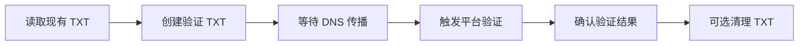

# GoodDealer 操作编排与任务语义

状态：Draft  
更新日期：2026-07-31

## 1. 优先级

| 级别 | 类型 | 示例 |
| --- | --- | --- |
| P0 Asset Protection | 资产保护 | 已售域名下架、结果未知写操作确认、凭证撤销 |
| P1 Interactive | 用户交互 | 当前批次提交、手动刷新、用户等待的验证 |
| P2 Workflow | 工作流延续 | DNS 传播、远端异步任务、上传结果检查 |
| P3 Bulk | 后台批量 | 大批量改价、导入和普通对账 |
| P4 Maintenance | 维护 | 全量刷新、压缩、历史清理 |

P0/P1 可以插入尚未开始的低优任务之前。已经发出的 HTTP 请求或正在执行的网页最终提交不强制中断；当前原子步骤完成后调度器必须让出执行权。

每个账户的限流预算为 P0/P1 保留一定比例，避免大批量刷新耗尽全部令牌。

## 2. Workflow DAG

`OperationBatch` 包含一个或多个 `Workflow`，Workflow 由 DAG 节点组成：

```text
Node
  id
  operation_item_id
  depends_on[]
  run_if: all_succeeded | any_failed | always
  resource_locks[]
  timeout
  retry_policy
```

示例：



DAG 在入队前检测环路。依赖节点失败时，下游按 `run_if` 进入 skipped、compensation 或人工处理。

最终批准产生 `ApprovedOperation`：

```text
operation_id
plan_hash
executor_device_id
approved_actions
approved_at
expires_at
device_signature
```

云端同步来的 Desired State 只能生成候选计划。Worker 必须验证本机设备签名、计划 Hash、动作范围、有效期和执行设备，不能把普通 Sync Mutation 当作执行授权。

## 3. 资源锁与顺序

常用互斥键：

```text
domain:{domain_asset_id}
registration:{registrar_binding_id}
dns-zone:{dns_binding_id}
listing:{marketplace_listing_id}
provider-connection:{connection_id}
afternic-portfolio-replace:{connection_id}
```

- Nameserver 变更与该域名的 DNS 写入互斥。
- Afternic Replace Portfolio 与该账户所有增量 Listing 操作互斥。
- 同一 Listing 的价格和上下架按计划版本串行。
- 本地资源锁保护活动设备内的任务顺序；账号级 ActiveDeviceLease 保证同一账号只有一台设备运行 Worker。外部人工修改仍由同步冲突机制发现。

## 4. 活动设备执行门禁

GoodDealer 不为每个 Operation 申请云端执行租约。Worker 只允许在当前活动设备运行，并在每个外部副作用前校验：

```text
ActiveDeviceLease.account_id
ActiveDeviceLease.device_id
ActiveDeviceLease.lease_epoch
ActiveDeviceLease.offline_execute_until
ApprovedOperation.executor_device_id
ApprovedOperation.active_lease_epoch
ApprovedOperation.plan_hash
ApprovedOperation.device_signature
local_resource_locks[]
```

- `device_id` 和 `active_lease_epoch` 必须同时匹配当前活动设备。
- ApprovedOperation 必须由本机设备密钥签名，且计划 Hash、动作范围和有效期都有效。
- GoodDealer 云可用时，活动设备持续续签 ActiveDeviceLease 并同步结果。
- GoodDealer 云不可用但 `offline_execute_until` 未到期时，可以继续读取和写入平台；这些结果标记为 `uncoordinated_execution` 并进入 Outbox。
- 24 小时离线执行许可到期后，不再发起新的平台读取或写入；本地查看、编辑和计划准备可以继续。
- 正在进行的原子 HTTP 请求不因许可到期被强杀，结果进入确认或 `outcome_unknown` 流程。
- 云恢复后，Worker 必须先上传未协调结果、确认结果未知项并完成必要对账，再领取新任务。
- 正常设备切换会停止领取新任务、排空 Outbox 并释放 Lease；切换到新设备后必须重新读取、预览和批准未执行计划。
- 强制切换后，旧 Epoch 的 Operation 结果、远端任务 ID、确认等级和审计事件经签名与防重放验证后作为 `LateExecutionEvent` 追加保存；Desired State 等可变修改才进入 `StaleDeviceCandidate`。

## 5. 取消语义

取消表示“不再发起新的副作用”，不保证撤销已经发生的外部副作用。

| 当前状态 | 取消行为 |
| --- | --- |
| planned/queued | 直接 `cancelled` |
| running，尚未提交 | 设置 `cancel_requested`，在下一安全点停止 |
| running，提交中 | 不关闭进程；等待结果或进入 `outcome_unknown` |
| waiting_remote | 若平台支持则创建远端取消节点；否则继续低频确认并标记用户已放弃后续动作 |
| waiting_dns | 停止后续验证；已写 DNS 保留，清理必须作为新的、可预览操作 |
| manual_action_required | 关闭人工任务，保留文件和审计记录 |
| succeeded | 不能取消；只能创建补偿操作 |

用户可以选择“停止跟踪”，但系统仍保留一个维护级确认任务，避免永久留下结果未知的外部写操作。

## 6. 幂等与结果未知

- 支持幂等键的平台使用稳定的 `operation_item_id` 派生键。
- 切换设备后仍保留同一 `operation_id/operation_item_id`；云端已确认成功的项目不得重新创建。
- 不支持幂等的平台在重试前必须先读取远端状态。
- 浏览器自动化在导航中断、窗口崩溃或回传不可信时进入 `outcome_unknown`。
- `outcome_unknown` 只允许执行确认节点，不允许直接重复提交。
- 设备切换不能丢弃 `outcome_unknown`：迟到的旧 Epoch 报告保留为 LateExecutionEvent，新活动设备继续执行确认节点。
- 补偿操作是新 Operation，不伪装成事务回滚。

## 7. 单实例与进程所有权

桌面版使用 Tauri Single Instance 能力或等效 OS 锁，确保同一数据目录只有一个 Writer 进程。

- 第二个启动实例只向主实例发送“聚焦/打开文件”消息后退出。
- 数据库记录本地 Worker 所有权和心跳，崩溃后需先确认原进程已退出再恢复任务。
- 不允许两个进程同时消费同一本地队列。
