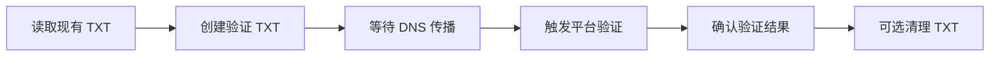

# GoodDealer 操作编排与任务语义

状态：Accepted Operations Baseline / Evidence Pending
更新日期：2026-08-05

## 1. 优先级

| 级别 | 类型 | 示例 |
| --- | --- | --- |
| Priority-0 Asset Protection | 资产保护 | 已售域名下架、结果未知写操作确认、凭证撤销 |
| Priority-1 Interactive | 用户交互 | 当前批次提交、手动刷新、用户等待的验证 |
| Priority-2 Workflow | 工作流延续 | DNS 传播、远端异步任务、上传结果检查 |
| Priority-3 Bulk | 后台批量 | 大批量改价、导入和普通对账 |
| Priority-4 Maintenance | 维护 | 全量刷新、压缩、历史清理 |

Priority-0/Priority-1 可以插入尚未开始的低优任务之前。已经发出的 HTTP 请求或正在执行的网页最终提交不强制中断；当前原子步骤完成后调度器必须让出执行权。

每个账户的限流预算为 Priority-0/Priority-1 保留一定比例，避免大批量刷新耗尽全部令牌。

## 2. Workflow DAG

批量计划不能只保存当前筛选表达式。选择阶段创建：

```text
BulkSelectionSpec
  query
  query_snapshot_revision
  exclusions[]
  selection_hash

OperationPlan
  materialized_target_ids[]
  touched_fields_by_target
  observed_preconditions_by_target
  connection_capability_versions
  freshness_requirements
  plan_hash
  validity: valid | needs_replan | expired
```

Planner 在批准前物化精确目标 ID 与动作；`selection_hash` 只用于检测选择漂移，不能代替成员列表。

计划不会因为任何无关后台刷新而整体作废。只有以下情况令受影响的目标或批次进入 `needs_replan`：

- 计划实际读取或修改的字段在对应实体上变化。
- 资源前置条件、DNS 委派/RRset Hash、目标 Listing/Binding 或 ProviderConnection 发生变化。
- 连接器 Capability/Recipe 版本变化会改变该动作语义。
- 平台读取时间超过计划声明的最大新鲜度阈值。

标签、备注或其他未被计划读取/修改的字段变化只提示，不使计划失效。重新规划后必须生成新 Plan Hash，并按当前 RuntimeMode 生成新的 `ApprovedOperation` 或 `SunsetApprovedOperation`；两种批准不能互换。

`OperationBatch` 包含一个或多个 `Workflow`，Workflow 由 DAG 节点组成：

```text
Node
  id
  operation_item_id
  depends_on[]
  run_if: all_succeeded | any_failed | always
  resource_locks[]
  timeout
  retry_policy
```

示例：



DAG 在入队前检测环路。依赖节点失败时，下游按 `run_if` 进入 skipped、compensation 或人工处理。

日常 Active 模式的最终批准产生 `ApprovedOperation`：

```text
operation_id
account_id
workspace_id
plan_hash
executor_device_id
active_lease_epoch
approved_actions
materialized_target_digest
connector_capability_versions
approved_at
expires_at
signing_key_id
signing_key_version
credential_epoch
signature_transcript_version
device_signature
```

签名 Transcript 使用 `GOODDEALER-APPROVED-OPERATION-V1` 域，对除 `device_signature` 外的完整字段做版本化、长度定界的确定性编码。云端同步来的 Desired State 只能生成候选计划。Worker 必须验证本机设备签名、签名 Key ID/Version、Credential Epoch、Transcript Version、账号/Workspace、计划 Hash、目标摘要、连接器能力版本、动作范围、有效期和执行设备，不能把普通 Sync Mutation 当作执行授权。

正式停服构建的 LocalContinuation 不伪造 ActiveDeviceLease 或 `active_lease_epoch`。它使用不可被日常解析器接受的 `SunsetApprovedOperation`：

Rust 先从已验证的 Sunset Credential 派生短期、Host-owned `SunsetAuthorization`，其规范字段为：

```text
authorization_id
schema_version
key_purpose: gooddealer.sunset.authorization.v1
purpose: platform_access | browser_connection_establishment
sunset_credential_id
sunset_credential_generation
sunset_installation_id
workspace_id
device_signing_key_id
device_signing_key_version
authorized_capabilities[]
provider_connection_id
credential_source: none | host_binding | browser_profile
credential_binding_id?                         # host_binding only
credential_profile_id / credential_profile_version?
credential_slot_set_digest / credential_health_generation?
browser_profile_id / browser_profile_generation? # browser_profile only
runtime_generation
trusted_time_anchor_id
trusted_time_deadline
issued_at / expires_at
host_authenticator
```

`SunsetAuthorization` 的 Transcript 域固定为 `GOODDEALER-SUNSET-AUTHORIZATION-V1`，认证 Key 从已验证 Sunset Credential、安装实例和设备 Key 的本地绑定派生。`purpose=browser_connection_establishment` 必须使用 `credential_source=none`，只允许登录、获取 API Key 或修复连接所需的窄能力；Credential/Binding 尚不存在或不健康不能阻止签发，它也不能授权业务提交。`purpose=platform_access` 必须在 `host_binding` 与 `browser_profile` 中选择一个封闭变体：前者要求完整 Binding/Profile/Slot digest/health generation，后者要求 Browser Profile ID/generation；另一变体字段或未知字段必须缺席。每次消费都重新读取 `RuntimeMode=LocalContinuation`、Sunset credential generation、runtime generation、本地可信时间和所选凭据来源的 generation；任何推进、回退、连接变更、能力越界或跨安装/Workspace 重放都在读取秘密、Profile 或网络资源前失败关闭。它不是日常 `PlatformAccessContext`，也不能被 Browser Session 或 automation-host 直接当作 Ticket。

在该授权下，最终批准使用不可被日常解析器接受的 `SunsetApprovedOperation`：

```text
operation_id
schema_version
key_purpose: gooddealer.sunset.approved-operation.v1
workspace_id
plan_hash
sunset_authorization_id
sunset_credential_id
sunset_installation_id
sunset_credential_generation
runtime_generation
executor_signing_key_id
executor_signing_key_version
approved_actions
materialized_target_digest
connector_capability_versions
provider_connection_id
credential_source: host_binding | browser_profile
credential_state_digest
credential_state_generation
trusted_time_anchor_id
approved_at
expires_at
signature_transcript_version
device_signature
```

其 Key Purpose 固定为 `gooddealer.sunset.approved-operation.v1`，Transcript 域固定为 `GOODDEALER-SUNSET-APPROVED-OPERATION-V1`。Rust 只在 `RuntimeMode=LocalContinuation` 且 `purpose=platform_access`、匹配连接/能力/所选凭据来源的 `SunsetAuthorization` 验证通过时签发；消费时重新验证 Authorization、runtime/Sunset credential generation 与 `credential_state_digest/generation`。日常 `ApprovedOperation`/`AutomationExecutionTicket` 与 `SunsetApprovedOperation`/`SunsetAutomationExecutionTicket` 的解析器、Key Purpose、Schema 和 Transcript 域互相拒绝，任何跨模式兑换都失败关闭。浏览器执行的完整 Sunset Session Context 与 Ticket 合同见 [浏览器自动化](BROWSER_AUTOMATION.md)。

LocalContinuation 的执行结果和审计同样不能伪造 Active 类型。权威结果合同为：

```text
SunsetExecutionFact
  execution_fact_id
  schema_version
  key_purpose: gooddealer.sunset.execution-fact.v1
  workspace_id
  sunset_credential_id
  sunset_installation_id
  sunset_credential_generation
  runtime_generation
  operation_id / operation_item_id / workflow_node_id
  attempt_id / attempt_no
  sunset_authorization_id
  sunset_approved_operation_id
  plan_hash
  idempotency_key_hash
  source_signing_key_id / source_signing_key_version
  sunset_execution_sequence
  previous_hash / event_hash
  event_type / evidence_level
  occurred_at
  trusted_time_anchor_id / monotonic_delta_ms
  request_start_boundary
  authorization_hash
  execution_authorization_evidence
  signature_transcript_version
  payload_redacted
  sunset_audit_event_ref / sunset_audit_event_hash
  device_signature
```

它不含 `account_id`、ActiveDeviceLease、`active_lease_epoch` 或 Credential Epoch。Key Purpose 固定为 `gooddealer.sunset.execution-fact.v1`，Transcript 固定为 `GOODDEALER-SUNSET-EXECUTION-FACT-V1`；每个 `(sunset_installation_id, workspace_id, source_signing_key_id, sunset_credential_generation)` 只有一条从 sequence 1 开始、以 `previous_hash + canonical envelope` 推进的本地唯一追加链。

权威 Sunset 审计合同为：

```text
SunsetDeviceAuditEvent
  audit_event_id
  schema_version
  key_purpose: gooddealer.sunset.device-audit.v1
  event_type
  workspace_id
  sunset_credential_id
  sunset_installation_id
  sunset_credential_generation
  runtime_generation
  actor_kind: user | device_service
  actor_id
  authorization_source: sunset_authorization | sunset_approved_operation | sunset_runtime_security_context
  authorization_ref / authorization_context_hash
  target_type / target_ref
  source_signing_key_id / source_signing_key_version
  sunset_audit_sequence
  previous_hash / event_hash
  occurred_at
  trusted_time_anchor_id / monotonic_delta_ms
  signature_transcript_version
  payload_redacted
  device_signature
```

其 Key Purpose 固定为 `gooddealer.sunset.device-audit.v1`，Transcript 固定为 `GOODDEALER-SUNSET-DEVICE-AUDIT-V1`；每个 `(sunset_installation_id, workspace_id, source_signing_key_id, sunset_credential_generation)` 只有一条本地唯一追加审计链。`authorization_source` 必须按事件类型选择：业务执行使用 `sunset_approved_operation`，连接建立或其他授权动作使用 `sunset_authorization`，模式/密钥/完整性等本地安全生命周期事件使用 `sunset_runtime_security_context`，不能用宽泛来源代替窄授权。

两种 Sunset Envelope 在每次签名和读取前都重新验证 LocalContinuation、安装/Workspace/设备 Key、runtime/Sunset credential generation 与本地可信时间，不得进入 Cloud execution-ledger/audit Ingest、MutationOutbox、Workspace 三流 Drain、LateExecutionEvent 分类或日常 ExecutionFact/DeviceAuditEvent 解析器。日常与 Sunset 解析器必须双向拒绝对方的 Key Purpose、Schema、Transcript 与字段联合。

## 3. 资源锁与顺序

常用互斥键：

```text
domain:{domain_asset_id}
registration:{registrar_binding_id}
dns-zone:{dns_binding_id}
listing:{marketplace_listing_id}
provider-connection:{connection_id}
afternic-portfolio-replace:{connection_id}
```

- Nameserver 变更与该域名的 DNS 写入互斥。
- Afternic Replace Portfolio 与该账户所有增量 Listing 操作互斥。
- 同一 Listing 的价格和上下架按计划版本串行。
- 本地资源锁保护活动设备内的任务顺序；账号级 ActiveDeviceLease 保证同一账号只有一台设备运行 Worker。外部人工修改仍由同步冲突机制发现。

## 4. 活动设备执行门禁

GoodDealer 不为每个 Operation 申请云端执行租约。日常 Worker 只允许在当前活动设备运行，并在每个外部副作用前校验：

```text
ActiveDeviceLease.account_id
ActiveDeviceLease.device_id
ActiveDeviceLease.lease_epoch
ActiveDeviceLease.offline_execute_until
ApprovedOperation.executor_device_id
ApprovedOperation.active_lease_epoch
ApprovedOperation.plan_hash
ApprovedOperation.device_signature
local_resource_locks[]
```

- `device_id` 和 `active_lease_epoch` 必须同时匹配当前活动设备。
- ApprovedOperation 必须由本机设备密钥签名，且计划 Hash、动作范围和有效期都有效。
- 浏览器动作还必须由 Secure Host 原子消费 ApprovedOperation/Grant 后签发一次性 AutomationExecutionTicket；automation-host 不接受普通 TypeScript 直接构造的执行请求。
- GoodDealer 云可用时，活动设备持续续签 ActiveDeviceLease 并同步结果。
- GoodDealer Cloud 不可达但外部平台可达且 `offline_execute_until` 未到期时，可以继续读取和写入平台；这些结果标记为 `uncoordinated_execution` 并进入独立 ExecutionFact 队列，对应 DeviceAuditEvent 进入设备 Audit 队列，不进入 Mutation Outbox。
- 24 小时离线执行许可到期后，不再发起新的平台读取或写入；本地查看、编辑和计划准备可以继续。
- 正在进行的原子 HTTP 请求不因许可到期被强杀，结果进入确认或 `outcome_unknown` 流程。
- 云恢复后，Worker 必须先上传未协调结果、确认结果未知项并完成必要对账，再领取新任务。
- `LocalContinuation` 是独立 Sunset 路径：每个外部请求校验 `SunsetAuthorization`；写操作再校验 `SunsetApprovedOperation`，浏览器写操作还必须原子消费 `SunsetAutomationExecutionTicket`。三者绑定安装实例/Workspace/设备 Key、runtime/Sunset credential generation、可信时间和所选 `host_binding | browser_profile` 凭据来源的 digest/generation，不读取或构造 ActiveDeviceLease/Epoch；连接建立专用 Authorization 使用 `credential_source=none` 且不能业务提交。结果和审计只追加 SunsetExecutionFact/SunsetDeviceAuditEvent 本地链；日常与 Sunset 的 Context、批准、Ticket、Fact 和审计签名域不可互换。
- 正常设备切换会停止领取新任务，分别冲刷 Mutation、ExecutionFact、Workspace-scope DeviceAuditEvent，并在服务端验证签名 handoff DrainManifest 后释放 Lease；Account-scope DeviceAuditEvent 独立续传，不阻塞 handoff。切换到新设备后必须重新读取、预览和批准未执行计划。
- 强制切换后，旧 Epoch 的 Operation 结果、远端任务 ID 和确认等级仍以 `ExecutionFact` 上传，经签名与防重放验证后标记为 `LateExecutionEvent`；对应 DeviceAuditEvent 经独立设备 Audit Ingest 进入自身 Hash 链，ExecutionFact 只保存引用。User/Staff/Service AuditEvent 属于服务端链；Desired State 等可变修改先形成签名 StaleChangeProposal，再由 Cloud recovery 生成 `StaleDeviceCandidate`。

## 5. 取消语义

取消表示“不再发起新的副作用”，不保证撤销已经发生的外部副作用。

| 当前状态 | 取消行为 |
| --- | --- |
| planned/queued | 直接 `cancelled` |
| running，尚未提交 | 设置 `cancel_requested`，在下一安全点停止 |
| running，提交中 | 不关闭进程；等待结果或进入 `outcome_unknown` |
| waiting_remote | 若平台支持则创建远端取消节点；否则继续低频确认并标记用户已放弃后续动作 |
| waiting_dns | 停止后续验证；已写 DNS 保留，清理必须作为新的、可预览操作 |
| manual_action_required | 关闭人工任务，保留文件和审计记录 |
| succeeded | 不能取消；只能创建补偿操作 |

`关闭人工任务` 不是可持久化终态。`ManualTask.status` 至少区分 `open | awaiting_user | verification_pending | confirmed_completed | cancelled | risk_accepted`，并在创建时从版本化 Task Policy Registry 固定 `risk_acceptance_policy: forbidden | allowed | fresh_reauth_required`。默认及未知策略均为 `forbidden`；只有 `allowed` 或 `fresh_reauth_required` 才能显示风险接受入口。后者必须消费绑定 `manual_task_id + task_revision + actor + unresolved_impact_digest` 的短期重新认证证明，并记录 `reauth_proof_id/verified_at/expires_at`。只有重新检查或平台权威回执确认后才能进入 `confirmed_completed` 并计入操作成功；`cancelled` 只表示放弃后续动作，OperationBatch 保持未完成/部分失败，紧急 Incident 也不能因此关闭；`risk_accepted` 必须记录未确认影响、actor、策略版本、理由和审计，只能在策略允许且 CAS 仍匹配当前 Task Revision 时聚合关闭 Incident。UI 可以把后三种显示为“已关闭”，但聚合器必须读取精确结果分类而不是布尔 `closed`。

用户可以选择“停止跟踪”，但系统仍保留一个维护级确认任务，避免永久留下结果未知的外部写操作。

## 6. Attempt、幂等与结果未知

每个可能产生外部副作用的节点拥有持久化 Attempt。最低阶段为：

```text
prepared
  -> request_started
  -> request_sent
  -> response_received
  -> remote_confirmation_pending
  -> confirmed | failed | outcome_unknown
```

- `prepared` 表示请求尚未跨过副作用边界，可以按策略安全重试。
- 写入 `request_started` 后必须先持久化幂等键、目标、计划 Hash 和恢复策略，再调用外部 Transport。
- `request_sent` 表示请求可能已经到达平台；此后崩溃、超时或回调丢失不得回到普通 retryable。
- `response_received` 只记录平台/页面响应，不自动等于业务成功。
- `remote_confirmation_pending` 等待 API、结果页、报告或用户证据。
- 无法证明请求未发送、也无法确认结果时进入 `outcome_unknown`，只允许执行确认节点。

- 支持幂等键的平台使用稳定的 `operation_item_id` 派生键。
- 切换设备后仍保留同一 `operation_id/operation_item_id`；云端已确认成功的项目不得重新创建。
- 不支持幂等的平台在重试前必须先读取远端状态。
- 浏览器自动化在导航中断、窗口崩溃或回传不可信时进入 `outcome_unknown`。
- `outcome_unknown` 只允许执行确认节点，不允许直接重复提交。
- 设备切换不能丢弃 `outcome_unknown`：迟到的旧 Epoch 报告保留为 LateExecutionEvent，新活动设备继续执行确认节点。
- 补偿操作是新 Operation，不伪装成事务回滚。

## 7. 单实例与进程所有权

桌面版使用 Tauri Single Instance 能力或等效 OS 锁，确保同一数据目录只有一个 Writer 进程。

- 第二个启动实例只向主实例发送“聚焦/打开文件”消息后退出。
- 数据库记录本地 Worker 所有权和心跳，崩溃后需先确认原进程已退出再恢复任务。
- 不允许两个进程同时消费同一本地队列。
- 启动后先扫描全部非终态 Attempt：`prepared` 可回到队列；跨过 `request_started/request_sent` 且无可信结果的项进入确认路径；`waiting_remote/waiting_dns` 恢复低频确认；已 `confirmed` 的项永不重提。
- 恢复扫描、Mutation/ExecutionFact/Workspace-scope DeviceAuditEvent 三流续传、旧 Epoch ExecutionFact 分类持久化和 `outcome_unknown` 对账完成前，Worker 不领取新任务；Account DeviceAudit 继续独立续传。
- 切入 Draining 前，Active 必须停止签发 PlatformAccessContext；已提交的单次请求等待返回或隔离为 `outcome_unknown`，对应 Fact/Audit Envelope 与序列持久化，尚未提交的 Context/请求作废。`Draining(reason=handoff)` 本身不访问平台、不落账新结果或分配新序列，只上传进入前既有 Envelope 并完成 Cloud 排空验收；`Draining(reason=suspend)` 也只尽力上传既有 Envelope，失败不阻塞应用退出，重启后按上述恢复顺序处理。
- ProviderConnection 级认证失败或平台级故障触发连接级熔断；暂停该连接剩余任务并只生成一个修复入口，避免为同一根因制造大量失败项。

## 8. 生产服务目标与运营证据

Account、License 与 Cloud Sync API 的初始月度可用性 SLO 为 99.5%。用户设备、本地执行以及第三方 Registrar、Marketplace、DNS、网络和支付 Provider 的可用性不计入该 Cloud SLO；界面与状态页必须区分 GoodDealer 故障和 Provider 故障。首期不提供赔付型 SLA。

- 生产数据目标为 RPO 15 分钟、RTO 4 小时；PITR 保留 35 天，每季度至少进行一次从隔离恢复环境到摘要验证的完整演练。
- Priority-0 告警目标为 15 分钟内由当值 Owner 确认。重大事故发布状态通告，并形成包含影响、时间线、遏制、恢复、数据完整性和改进项的事后报告。
- Production 主处理区固定为 AWS `ap-southeast-1`，加密灾备副本固定为 `ap-southeast-2`。主库使用 Multi-AZ；跨区复制、恢复和删除传播必须有可重跑证据。
- Development 仅允许 Fixture/纯员工合成数据。Development、Staging、Production 使用独立账号、网络、数据库、对象存储、IAM、KMS Key 和密钥管理员；生产数据不得下放到更低信任环境。
- 版本库 IaC 是唯一拓扑事实源。控制台紧急变更必须有 Incident/Purpose、重新认证、审计，并在事件结束后回写 IaC 或回滚，不能成为长期事实。
- KMS 至少每年轮换一次，并维护紧急轮换 Runbook；Schema Migration、Checkpoint 压缩、备份恢复和删除传播均记录 Owner、版本、前后水位和回滚/失败关闭结果。
- 用户备份导入支持当前及前两个 Major，并至少覆盖最近 24 个月生成的受支持 Schema；更旧备份通过仍受支持的中间版本迁移或人工恢复处理。

JF-16/JF-18 只有在真实环境的 PITR、告警响应、恢复、跨区复制、删除传播、KMS/IaC 和租户隔离证据通过后才能关闭；本节参数落档本身不等于 Gate 通过。

## 9. 开源实现参考

完整来源、许可证和使用级别见 [OPEN_SOURCE_REFERENCES.md](OPEN_SOURCE_REFERENCES.md)。

| 来源 | 可迁移内容 | GoodDealer 特有边界 |
| --- | --- | --- |
| [Temporal](https://github.com/temporalio/temporal) | Workflow/Activity 分离、持久历史、Timer、取消、重试、版本演进和故障注入场景 | 只迁移语义和 Conformance Corpus，不在桌面客户端嵌入 Temporal Server；本地 SQLite 仍是 Operation/Attempt 正确性来源 |
| [pg-boss](https://github.com/timgit/pg-boss) | Cloud Jobs 的 PostgreSQL 事务内入队、SKIP LOCKED、Retry、DLQ、Cron 和依赖工作流 | 只用于 Cloud Jobs，不替代桌面 Operation DAG；Queue 的 exactly-once claim 不代表外部平台副作用 exactly-once |
| [Tauri Single Instance](https://github.com/tauri-apps/plugins-workspace) | 本机进程单实例和聚焦消息 | 不替代 Worker 心跳、数据目录 Writer 所有权、ActiveDeviceLease 或跨设备单执行者 |
| [JobCtrl](https://github.com/ebarti/JobCtrl) | Review Queue、批准绑定精确材料、人工接管和崩溃恢复 UX | AGPL，只作设计/测试参考，不复制实现 |

Temporal 的“重试 Activity”不得被翻译成统一自动重试。每个 Connector 操作仍消费 `retrySafety`；跨过 `request_started/request_sent` 后只能按本文件的确认和 `outcome_unknown` 语义恢复。
